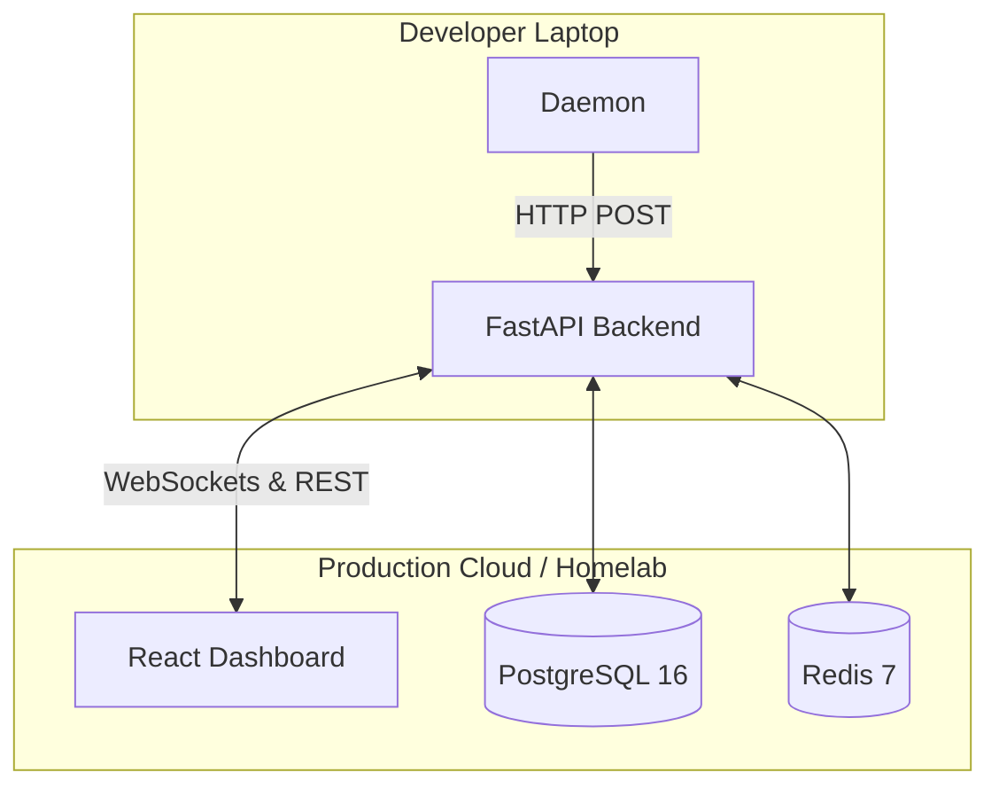

# Deployment Guide

This guide describes how to deploy VibePulse in a production environment (v1.0.0).

VibePulse is designed as a single-tenant or internal tooling application. Because of the nature of file system observation, the **Daemon** runs locally on the developer's machine, while the **API**, **Database**, and **Dashboard** can be hosted centrally.

## Production Topology



---

## 1. Deploying the Backend Services (Docker)

The provided `docker-compose.yml` supports spinning up the API along with its dependencies natively.

### Server Requirements

- **OS**: Linux (Ubuntu 22.04 LTS or Amazon Linux 2023 recommended)
- **RAM**: 4GB+ (Heavy AST parsing during analysis requires memory headroom)
- **vCPU**: 2+ cores

### Deployment Steps

1. Clone the repository on your server:

   ```bash
   git clone https://github.com/sanket200511/VibePulse.git
   cd VibePulse
   ```

2. Configure environment variables for production:

   ```bash
   cp .env.example .env
   ```

   **Critical `.env` edits for Production:**
   - `CORS_ORIGINS`: Set this to your actual production dashboard URL (e.g., `https://vibepulse.mycompany.com`).
   - `DATABASE_URL`: Ensure a secure password is used.
   - `ENVIRONMENT`: Set to `production`.

3. Build and Start the Docker containers:

   ```bash
   docker compose -f docker-compose.yml up -d --build
   ```

4. Verify services:
   ```bash
   docker compose ps
   ```

---

## 2. Deploying the Dashboard (Frontend)

The VibePulse dashboard is a statically generated single-page application (SPA). It can be hosted on Vercel, AWS S3 + CloudFront, Nginx, or directly via the provided Docker setup.

### Building for Production

If deploying manually (e.g., to an Nginx server):

1. Install dependencies:
   ```bash
   pnpm install
   ```
2. Build the Vite application:
   ```bash
   pnpm --filter @vibepulse/dashboard build
   ```
3. Copy the output:
   The `apps/dashboard/dist` folder contains the production-ready assets.

### Nginx Configuration Example

If serving via Nginx, ensure you route all unknown requests back to `index.html` to support React Router:

```nginx
server {
    listen 80;
    server_name vibepulse.mycompany.com;
    root /var/www/vibepulse;

    index index.html;

    location / {
        try_files $uri $uri/ /index.html;
    }

    # Proxy WebSocket connections to the API
    location /ws/ {
        proxy_pass http://localhost:8080;
        proxy_http_version 1.1;
        proxy_set_header Upgrade $http_upgrade;
        proxy_set_header Connection "Upgrade";
        proxy_set_header Host $host;
    }
}
```

---

## 3. Running the Daemon (Client Side)

Every developer participating in the workspace must run the daemon locally to transmit events to the central server.

1. Install Node.js on the local machine.
2. Clone the repository (or distribute a compiled binary of the daemon in the future).
3. Configure `apps/daemon/.env`:
   ```env
   # Point the daemon to your production API
   API_URL=https://api.vibepulse.mycompany.com
   ```
4. Start the daemon:
   ```bash
   pnpm --filter @vibepulse/daemon dev
   ```

_(Note: Daemon binary packaging via `pkg` or `bun` is tracked for a post-v1.0 release)._

---

## Scaling & High Availability

- **Stateless API**: The FastAPI application is completely stateless. You can run multiple instances behind a load balancer.
- **Session Sweep Loop**: Currently, the session finalization sweep loop runs in-memory. If running multiple API replicas, ensure you configure a Redis distributed lock (to be implemented in v1.1) to avoid duplicate summary generations.
- **Database**: PostgreSQL handles idempotent deduplication (`ON CONFLICT DO UPDATE`). Scaling vertically is recommended over horizontally for the database at this stage.
