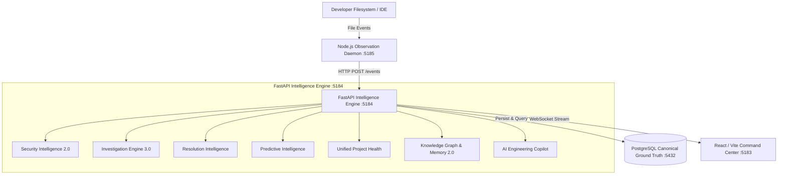

<div align="center">
  

  <br />

  <h1>DepRadar</h1>
  <p><strong>The Deterministic Engineering Intelligence Platform & AI Copilot Foundation</strong></p>
  <p><em>Observe First. Derive Carefully. Never Invent.</em></p>

  <div>
    <a href="https://github.com/sanket200511/Vortex-DepRadar/releases"></a>
    <a href="LICENSE"></a>
    <a href="CONTRIBUTING.md"></a>
    <a href="docs/DOCUMENTATION_INDEX.md"></a>
  </div>
  <br />
</div>

**DepRadar** is a deterministic, event-driven engineering intelligence and investigation platform. It provides an end-to-end continuous loop from filesystem telemetry to causal root cause investigation, predictive risk forecasting, semantic knowledge graph traversal, and zero-hallucination AI Copilot assistance.

```
OBSERVE ──▶ DETECT ──▶ UNDERSTAND ──▶ INVESTIGATE ──▶ RESOLVE ──▶ LEARN ──▶ PREDICT ──▶ ASK ──▶ ACT ──▶ MEMORY
```

---

## ⚡ Core Capabilities

### 🎛️ Unified Intelligence Command Center

The central engineering cockpit displaying the **Metric Triad**:

- **Overall Health Score** ($0 \dots 100$, **Higher = Better**): 5-dimension composite (`Security`, `Engineering Stability`, `Incident Health`, `Resolution Health`, `Predictive Risk`).
- **Security Risk Score** (Points, **Higher = Worse**): Real-time sum of unmitigated AST security rules (`SEC001`, `DEBUG_TRUE`, credential leaks).
- **Forecast Strength** ($0 \dots 100$, **Empirical Baseline**): Statistical confidence tier based on historical observation frequency and commit velocity.
- **Embedded Copilot Mini-Console**: Ask grounded natural engineering questions with immediate `[Why?]` evidence triggers.

### 🤖 AI Engineering Copilot Foundation (Zero LLM Dependency)

Deterministic orchestration and retrieval over canonical PostgreSQL telemetry supporting 16 canonical query families with explicit tri-state provenance:

- `[OBSERVED]`: Directly recorded filesystem telemetry and AST rules.
- `[INFERRED]`: Deterministically derived health metrics, priority rankings, and forecasts.
- `[UNKNOWN]`: Explicit observation boundaries (out-of-band deployments, remote CI).
- **Answerability Gate**: Cleanly rejects out-of-scope queries (market prices, weather, elections, private emails) without hallucination.

### 🔍 Universal Evidence Inspector & Trust Engine

- Mathematical 5-dimension score decomposition ($W_i \times S_i$).
- Multi-step causal evidence graphs connecting observed file modifications, AST detections, incident creation, and health impacts.

### 🔮 Predictive Engineering Intelligence

- Statistical regression and code churn acceleration forecasts.
- File and subsystem hotspot detection and focus drift analysis.

### 🕸️ Engineering Knowledge Graph & Project Memory 2.0

- Semantic multi-entity graph traversal (`CONTAINS`, `BELONGS_TO`, `AFFECTS`, `RESOLVED_BY`, `SUPPORTS`).
- Portable `PROJECT_CONTEXT.md` AI handoff export with complete guidance for downstream AI agents.

---

## 🏗️ Architecture & Invariants



### Core Invariants

- **PostgreSQL is the ONLY canonical ground truth**: Zero duplicate state machines or in-memory caches.
- **Zero Hallucination**: Pure deterministic projections ($A \equiv B$).
- **Secret Redaction**: Raw tokens and credentials matching token patterns are strictly masked to `[REDACTED]`.
- **Multi-Project Isolation**: Telemetry and context for Project A are completely segregated from Project B.
- **Safe Project Deletion**: Removing a project from DepRadar deletes only telemetry records; user code remains untouched on disk.

---

## 🔌 Dedicated Port Namespace

| Service                      | Dedicated Port | URL Endpoint                   | Description                          |
| ---------------------------- | -------------- | ------------------------------ | ------------------------------------ |
| **FastAPI Backend (API)**    | **`5184`**     | `http://localhost:5184`        | REST & WebSocket intelligence engine |
| **FastAPI Interactive Docs** | **`5184`**     | `http://localhost:5184/docs`   | OpenAPI / Swagger specification      |
| **React Dashboard (UI)**     | **`5183`**     | `http://localhost:5183`        | Vite dev server & Command Center UI  |
| **Telemetry Daemon**         | **`5185`**     | `http://localhost:5185/health` | Filesystem watcher & health server   |
| **PostgreSQL**               | **`5432`**     | `localhost:5432`               | Canonical source of truth            |

---

## 🚀 Quick Start

```bash
# 1. Install workspace dependencies
pnpm install

# 2. Setup Python environment and run database migrations
cd apps/api && uv sync && uv run alembic upgrade head && cd ../..

# 3. Start local development supervisor (with structured logging)
pnpm dev

# 4. Check instant runtime stack status
pnpm dev:status
```

---

## 🧪 Verification & Quality Baselines

- **Backend Pytest**: 349 / 349 passed (`cd apps/api && uv run pytest`)
- **Daemon Vitest**: 130 / 130 passed (`pnpm --filter @depradar/daemon test`)
- **Total Automated Tests**: 479 / 479 passed
- **TypeScript Typecheck**: 5 / 5 packages passed (0 errors) (`pnpm typecheck`)
- **Lint & Ruff**: 5 / 5 packages passed (0 errors) (`pnpm lint`)
- **Seminar Doctor**: ALL CHECKS PASS (`node scripts/seminar-doctor.mjs`)
- **Ephemeral Project Lifecycle**: 100% Guaranteed Teardown (`node scripts/test-lifecycle-cleanup.mjs`)
- **Ephemeral Cleanup Utility**: Dry-run (`pnpm cleanup:ephemeral`) & Confirmed (`pnpm cleanup:ephemeral:confirm`)
- **Sprint 12 E2E Acceptance Test**: 14 / 14 criteria passed (`node scripts/test-sprint12-e2e.mjs`)
- **Live Demo Runner**: 10-stage loop passed (`node scripts/final-demo.mjs`)
- **Security Redaction Audit**: 100% PASS (`node scripts/final-security-audit.mjs`)
- **Deterministic Reconstructibility**: 100% PASS ($A \equiv B$) (`node scripts/final-reconstructibility-audit.mjs`)

---

## 📚 Master Documentation Index

For exhaustive architecture, operational guides, and academic portfolios, refer to the [**Master Documentation Index**](docs/DOCUMENTATION_INDEX.md) and [**Docs Directory**](docs/README.md):

- **Architecture Deep Dive**: [`docs/architecture/ARCHITECTURE.md`](docs/architecture/ARCHITECTURE.md)
- **Local Development Guide**: [`docs/development/LOCAL_DEVELOPMENT.md`](docs/development/LOCAL_DEVELOPMENT.md)
- **API Reference**: [`docs/api/API_REFERENCE.md`](docs/api/API_REFERENCE.md)
- **Security & Privacy**: [`SECURITY.md`](SECURITY.md)
- **Academic Thesis Report**: [`docs/academic/FINAL_PROJECT_REPORT.md`](docs/academic/FINAL_PROJECT_REPORT.md)
- **Viva Master Sheet**: [`docs/academic/VIVA_MASTER_SHEET.md`](docs/academic/VIVA_MASTER_SHEET.md)
- **Live Demo Runbook**: [`docs/demos/FINAL_DEMO_RUNBOOK.md`](docs/demos/FINAL_DEMO_RUNBOOK.md)

---

## ⚠️ Current Scope & Limitations (v1.0.0 Architecture Freeze)

- **Single-Host Local Deployment**: Optimized for local-first developer workstations and seminar presentations. Multi-user RBAC and distributed Redis queuing are scheduled for post-freeze v2.0 releases.
- **Zero In-Memory Drift**: State is recomputed from PostgreSQL; in-memory caching is intentionally omitted to guarantee $A \equiv B$ determinism.
