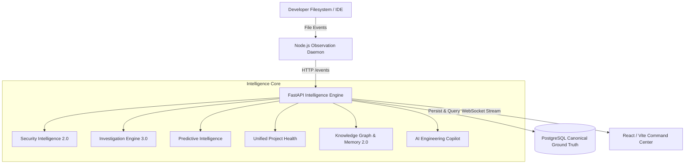

<div align="center">
  

  <br />

  <h1>VibePulse</h1>
  <p><strong>The Deterministic Engineering Intelligence Platform & AI Copilot Foundation</strong></p>
  <p><em>Observe First. Derive Carefully. Never Invent.</em></p>

  <div>
    <a href="https://github.com/sanket200511/VibePulse/releases"></a>
    <a href="LICENSE"></a>
    <a href="CONTRIBUTING.md"></a>
  </div>
  <br />
</div>

**VibePulse** is a deterministic, event-driven engineering intelligence and investigation platform. It provides an end-to-end continuous loop from filesystem telemetry to causal root cause investigation, predictive risk forecasting, semantic knowledge graph traversal, and zero-hallucination AI Copilot assistance.

```
OBSERVE ──▶ DETECT ──▶ UNDERSTAND ──▶ INVESTIGATE ──▶ RESOLVE ──▶ LEARN ──▶ PREDICT ──▶ ASK ──▶ ACT
```

---

## ⚡ Core Capabilities

### 🎛️ Unified Intelligence Command Center

The central engineering cockpit displaying the **Metric Triad**:

- **Overall Health Score** ($0 \dots 100$, **Higher = Better**): 5-dimension composite (`Security`, `Engineering Stability`, `Incident Health`, `Resolution Health`, `Predictive Risk`).
- **Security Risk Score** (Points, **Higher = Worse**): Real-time sum of unmitigated AST security rules (`SEC001`, `DEBUG_TRUE`, credential leaks).
- **Forecast Strength** ($0 \dots 100$, **Empirical Baseline**): Statistical confidence tier based on historical observation frequency and commit velocity.
- **Embedded Copilot Mini-Console**: Ask grounded natural engineering questions with immediate `[Why?]` evidence triggers.

### 🤖 AI Engineering Copilot Foundation (Zero LLM Dependency)

Deterministic orchestration and retrieval over canonical PostgreSQL telemetry supporting 16 canonical query families with explicit tri-state provenance:

- `[OBSERVED]`: Directly recorded filesystem telemetry and AST rules.
- `[INFERRED]`: Deterministically derived health metrics, priority rankings, and forecasts.
- `[UNKNOWN]`: Explicit observation boundaries (out-of-band deployments, remote CI).
- **Answerability Gate**: Cleanly rejects out-of-scope queries (market prices, weather, elections, private emails) without hallucination.

### 🔍 Universal Evidence Inspector & Trust Engine

- Mathematical 5-dimension score decomposition ($W_i \times S_i$).
- Multi-step causal evidence graphs connecting observed file modifications, AST detections, incident creation, and health impacts.

### 🔮 Predictive Engineering Intelligence

- Statistical regression and code churn acceleration forecasts.
- File and subsystem hotspot detection and focus drift analysis.

### 🕸️ Engineering Knowledge Graph & Project Memory 2.0

- Semantic multi-entity graph traversal (`CONTAINS`, `BELONGS_TO`, `AFFECTS`, `RESOLVED_BY`, `SUPPORTS`).
- Portable `PROJECT_CONTEXT.md` AI handoff export with complete guidance for downstream AI agents.

---

## 🏗️ Architecture & Invariants



### Core Invariants

- **PostgreSQL is the ONLY canonical ground truth**: Zero duplicate state machines or in-memory caches.
- **Zero Hallucination**: Pure deterministic projections ($A \equiv B$).
- **Secret Redaction**: Raw tokens and credentials matching token patterns are strictly masked to `[REDACTED]`.
- **Multi-Project Isolation**: Telemetry and context for Project A are completely segregated from Project B.
- **Safe Project Deletion**: Removing a project from VibePulse deletes only telemetry records; user code remains untouched on disk.

---

## 🚀 Getting Started

```bash
# 1. Install workspace dependencies
pnpm install

# 2. Setup Python environment and run migrations
cd apps/api && uv sync && uv run alembic upgrade head && cd ../..

# 3. Start local seminar demonstration
pnpm dev:seminar
```

---

## 🧪 Verification & Quality Baselines

- **Backend Pytest**: 347 / 347 passed
- **Daemon Vitest**: 130 / 130 passed
- **TypeScript Typecheck**: 5 / 5 packages passed (0 errors)
- **Lint & Ruff**: 5 / 5 packages passed (0 errors)
- **Sprint 12 E2E Acceptance Test**: 14 / 14 criteria passed (`node scripts/test-sprint12-e2e.mjs`)
- **Seminar Demo Runner**: 10-stage loop passed (`node scripts/demo-command-center.mjs`)
