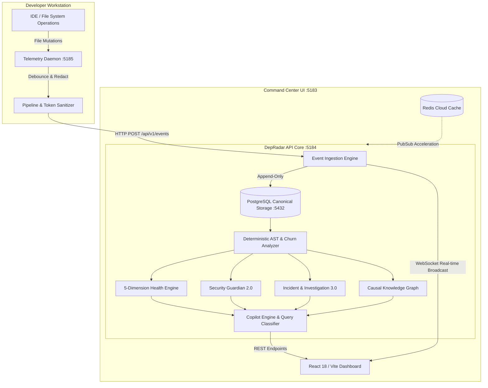

<div align="center">
  

  <br />

  <h1>DepRadar</h1>
  <p><strong>The Deterministic Engineering Intelligence Platform & AI Copilot Foundation</strong></p>
  <p><em>Observe First. Derive Carefully. Never Invent.</em></p>

  <div>
    <a href="https://github.com/sanket200511/Vortex-DepRadar/releases"></a>
    <a href="LICENSE"></a>
    <a href="CONTRIBUTING.md"></a>
    <a href="docs/DOCUMENTATION_INDEX.md"></a>
    
    
  </div>
  <br />
</div>

---

**DepRadar** is a local-first, deterministic, event-driven engineering intelligence and investigation platform. It provides an end-to-end continuous loop from filesystem telemetry to causal root-cause investigation, predictive risk forecasting, semantic knowledge graph traversal, and zero-hallucination AI Copilot assistance.

```
OBSERVE ──▶ DETECT ──▶ UNDERSTAND ──▶ INVESTIGATE ──▶ RESOLVE ──▶ LEARN ──▶ PREDICT ──▶ ASK ──▶ ACT ──▶ MEMORY
```

---

## 📑 Table of Contents

1. [Overview & Key Philosophy](#-overview--key-philosophy)
2. [Key Capabilities](#-key-capabilities)
3. [System Architecture](#-system-architecture)
4. [Technology Stack](#-technology-stack)
5. [How It Works (Working Mechanism)](#-how-it-works-working-mechanism)
6. [User Flows & Core Workflows](#-user-flows--core-workflows)
7. [Repository Folder Structure](#-repository-folder-structure)
8. [Port Namespace & Network Topology](#-port-namespace--network-topology)
9. [Getting Started & Local Setup](#-getting-started--local-setup)
10. [Automated Verification & Quality Baselines](#-automated-verification--quality-baselines)
11. [Master Documentation Index](#-master-documentation-index)
12. [License](#-license)

---

## 🧭 Overview & Key Philosophy

Modern software engineering environments suffer from fragmented telemetry: IDE edits, git operations, AST security issues, test breaks, and developer focus drift are scattered across isolated tools.

DepRadar unifies engineering visibility into a **single, local-first cockpit** powered by three foundational invariants:

- **PostgreSQL is the Sole Ground Truth**: Zero duplicate state machines, zero in-memory drift. All state is reconstructed from canonical database records.
- **Zero Hallucination ($A \equiv B$)**: Unlike probabilistic AI tools that guess project status, DepRadar computes deterministic metric projections directly from recorded telemetry. State replay yields identical outputs every time.
- **Edge Secret Redaction**: Credentials, API tokens, and secrets matching AST rules are stripped or masked to `[REDACTED]` _before_ telemetry ever leaves local memory.
- **Strict Project Isolation**: Workspace data is partitioned cleanly; deleting a project removes telemetry cleanly without touching source files on disk.

---

## ⚡ Key Capabilities

### 🎛️ Unified Intelligence Command Center

The central engineering cockpit displaying the **Metric Triad**:

- **Overall Health Score** ($0 \dots 100$, **Higher = Better**): 5-dimension weighted composite (`Security`, `Stability`, `Incidents`, `Resolution`, `Predictive Risk`).
- **Security Risk Score** (Points, **Higher = Worse**): Real-time sum of unmitigated AST security rules (`SEC001`, `DEBUG_TRUE`, hardcoded tokens, SQL injections).
- **Forecast Strength** ($0 \dots 100$, **Statistical Baseline**): Empirical confidence tier derived from historical observation density and commit velocity.
- **Embedded Copilot Mini-Console**: Ask natural engineering queries directly from the cockpit with one-click `[Why?]` evidence breakdowns.

### 🤖 Grounded AI Engineering Copilot (Zero LLM Dependency)

Deterministic orchestration and retrieval over canonical PostgreSQL telemetry supporting **16 canonical query families** with explicit tri-state provenance:

- **`[OBSERVED]`**: Directly recorded filesystem telemetry, git changes, and AST rules.
- **`[INFERRED]`**: Deterministically derived health metrics, priority rankings, and regressions.
- **`[UNKNOWN]`**: Explicit observation boundaries (e.g., out-of-band cloud deploys, unmonitored branches).
- **Answerability Gate**: Cleanly rejects out-of-scope questions (weather, general trivia, stock prices) without fabricating information.

### 🔍 Universal Evidence Inspector & Trust Engine

- **Mathematical Decomposition**: Mathematical score verification ($W_i \times S_i$) displaying exactly how every point was calculated.
- **Causal Evidence Graphs**: Directed step-by-step links tying a file edit $\to$ AST detection $\to$ incident creation $\to$ metric impact.

### 🕸️ Interactive Knowledge Graph & Causal Canvas

- Semantic multi-entity graph traversal (`CONTAINS`, `BELONGS_TO`, `AFFECTS`, `RESOLVED_BY`, `SUPPORTS`).
- High-performance Canvas renderer featuring pan/zoom gestures, node selection, fullscreen investigation mode, and hop-depth filtering.

### 🔮 Predictive Engineering Intelligence

- Statistical regression and code churn acceleration forecasts.
- Subsystem hotspot detection and focus drift analysis to detect tech debt accumulation before incidents occur.

### 🧠 Project Memory 2.0 & AI Handoff

- Generate portable, production-grade `PROJECT_CONTEXT.md` context files.
- Serves as the ultimate zero-hallucination handoff briefing for downstream AI coding agents (Gemini, Claude, Cursor).

---

## 🏗️ System Architecture



### Architectural Invariants:

1. **Single Source of Truth**: PostgreSQL holds all sessions, events, incidents, security findings, and metrics.
2. **Local-First Speed**: Event ingestion takes $< 5\text{ms}$; dashboard WebSocket updates arrive with zero polling lag.
3. **Safe Project Deletion**: Database deletion cascades completely (`sessions`, `events`, `analyses`), but never deletes user source files.

---

## 💻 Technology Stack

| Layer                  | Technologies & Tools                                   | Rationale                                                                          |
| ---------------------- | ------------------------------------------------------ | ---------------------------------------------------------------------------------- |
| **Monorepo & Tooling** | PNPM Workspaces, Turborepo, Node.js 20+, UV, Git       | Blazing fast workspace execution, cached builds, unified Python + Node management  |
| **Frontend UI**        | React 18, Vite, TypeScript, Lucide React, HTML5 Canvas | Ultra-responsive 60fps rendering, custom glassmorphism design, zero Tailwind bloat |
| **Backend API**        | Python 3.12+, FastAPI, Uvicorn, Pydantic v2            | High-concurrency async API, strict schema validation, self-documenting OpenAPI     |
| **Data Persistence**   | PostgreSQL 16+, SQLAlchemy 2.0 (AsyncIO), Alembic      | ACID-compliant relational storage, complete migration history, zero data drift     |
| **In-Memory / PubSub** | Redis / Upstash Redis                                  | Low-latency state pub/sub and high-throughput session coordination                 |
| **Telemetry Daemon**   | Node.js, TypeScript, Chokidar, Express                 | Cross-platform filesystem watcher, low CPU footprint, non-blocking I/O             |
| **Quality & Testing**  | Vitest, Pytest, Ruff, ESLint, Prettier                 | Multi-layer test automation across TypeScript and Python runtimes                  |

---

## ⚙️ How It Works (Working Mechanism)

```
[File Edit in IDE]
       │
       ▼
1. Telemetry Capture (Daemon :5185)
   └── Chokidar detects file add/change/unlink; Debouncer aggregates bursts (150ms).
       │
       ▼
2. Edge Token Redaction & Normalization
   └── Regular expression filters inspect content; secrets and tokens are masked to [REDACTED].
       │
       ▼
3. Batch Ingestion (FastAPI :5184)
   └── Events are validated with Pydantic and written to PostgreSQL `development_events`.
       │
       ▼
4. Deterministic Analysis Engine
   └── AST parsing inspects code for vulnerabilities (hardcoded secrets, SQL injection patterns).
   └── Git churn and file hotspot frequencies are recalculated.
       │
       ▼
5. 5-Dimension Health Calculation
   └── Metric Triad is derived: Overall Health (0-100), Security Risk Score, and Forecast Strength.
       │
       ▼
6. Knowledge Graph & Causal Linking
   └── Entities (Files, Findings, Incidents) are mapped into directed graph relationships.
       │
       ▼
7. Real-Time Streaming & Copilot Access
   └── WebSocket broadcasts state updates to React Dashboard (:5183).
   └── Copilot Query Classifier responds to engineering questions with tri-state citations.
```

---

## 🔄 User Flows & Core Workflows

### Flow 1: Workspace Registration & Active Observation

1. Navigate to **Workspace Home** (`http://localhost:5183/`).
2. Register a new repository root path (e.g. `D:\CodeForge2026`).
3. The Telemetry Daemon automatically initiates an observation gate and binds to the target project.
4. Active status appears immediately on the header bar: `Observation: ACTIVE`.

### Flow 2: Live Metric Triad & Command Center

1. Open the **Command Center** (`http://localhost:5183/command-center`).
2. Monitor real-time telemetry metrics:
   - **Health Score**: Tracks stability and decreases if security rules fail.
   - **Security Risk Score**: Accumulates points based on critical AST findings.
   - **Forecast Confidence**: Estimates stability trajectory based on churn velocity.
3. Observe live developer event stream updating via WebSocket as code changes occur.

### Flow 3: Security & Incident Root Cause Investigation

1. When a security finding occurs (e.g. `SEC001: Hardcoded Secret`), click **Investigate**.
2. Review the causal chain:
   - **Event**: Exact file mutation timestamp and git author.
   - **Evidence**: AST rule violation highlighting exact code location.
   - **Impact**: Score degradation breakdown.
   - **Remediation**: Actionable guidance to resolve the finding.

### Flow 4: Interactive Causal Knowledge Graph

1. Navigate to **Knowledge Graph** (`http://localhost:5183/knowledge-graph`).
2. Visualize the interconnected web of Files, Modules, Incidents, and Findings.
3. Use pan, zoom, and hop-filtering to isolate dependencies and pinpoint blast radiuses.
4. Switch to **Fullscreen Canvas Mode** for presentation and architecture reviews.

### Flow 5: Grounded Copilot Consultation

1. Navigate to **Copilot** (`http://localhost:5183/copilot`) or use the mini-console on any page.
2. Ask questions such as:
   - _"What files changed in the last hour?"_
   - _"Why did the project health score drop?"_
   - _"What are our highest severity security risks?"_
3. Receive responses backed strictly by `[OBSERVED]` records, avoiding AI hallucinations.

### Flow 6: Project Memory Export & AI Handoff

1. Go to **Project Settings / Context Memory**.
2. Click **Export Project Context**.
3. DepRadar generates a comprehensive `PROJECT_CONTEXT.md` markdown snapshot containing the architecture, active dependencies, telemetry state, and open incidents for downstream agents.

---

## 📂 Repository Folder Structure

```text
DepRadar/
├── .github/                    # CI/CD Workflows & GitHub Actions configurations
│   └── workflows/
│       └── ci.yml              # Multi-job quality pipeline (Lint, Typecheck, Pytest, Vitest)
├── apps/
│   ├── api/                    # FastAPI Backend Engine (Port 5184)
│   │   ├── alembic/            # Database schema migration versions
│   │   ├── app/
│   │   │   ├── core/           # Database setup, config, redis, exceptions, logging
│   │   │   └── features/       # Modular feature domains:
│   │   │       ├── analysis/   # AST rule parsers, dependency analysis, churn metrics
│   │   │       ├── copilot/    # Zero-hallucination query classifier & answer engine
│   │   │       ├── events/     # Telemetry ingestion, event models, schema validation
│   │   │       ├── evidence/   # Mathematical score decomposition & proof trees
│   │   │       ├── health/     # 5-dimension deterministic project health engine
│   │   │       ├── investigation/ # Causal root cause analyzer & incident tracking
│   │   │       ├── knowledge_graph/ # Multi-entity relationship graph service
│   │   │       ├── predictive_intelligence/ # Hotspots, risk forecast, focus drift
│   │   │       ├── project_context/ # Project memory & AI handoff export service
│   │   │       ├── projects/   # Multi-project isolation, registration, cascade deletion
│   │   │       └── security_intelligence/ # AST security scanner & vulnerability rules
│   │   ├── scripts/            # Database maintenance & project cleanup utilities
│   │   ├── tests/              # Comprehensive Pytest test suite (349 tests)
│   │   └── pyproject.toml      # Python dependencies & UV environment spec
│   │
│   ├── daemon/                 # Telemetry Observation Daemon (Port 5185)
│   │   ├── src/
│   │   │   ├── debouncer.ts    # Burst event aggregator
│   │   │   ├── health-server.ts# Daemon status & observation gate HTTP server
│   │   │   ├── normaliser.ts   # Event payload standardization & secret masking
│   │   │   ├── pipeline.ts     # Ingestion pipeline & backend dispatcher
│   │   │   ├── project-registrar.ts # Dynamic project directory registration
│   │   │   └── watcher.ts      # Chokidar cross-platform filesystem monitor
│   │   └── package.json
│   │
│   └── dashboard/              # React 18 / Vite Command Center (Port 5183)
│       ├── src/
│       │   ├── api/            # REST and WebSocket client connectors
│       │   ├── components/     # Shared UI primitives, cards, badges, modals
│       │   ├── pages/          # Full-page application views:
│       │   │   ├── command-center/ # Live telemetry cockpit & Metric Triad
│       │   │   ├── copilot/        # Grounded AI conversation interface
│       │   │   ├── evidence/       # Trust engine & mathematical decomposition
│       │   │   ├── investigation/  # Incident drill-down & causal timeline
│       │   │   ├── knowledge-graph/# Canvas interactive relationship graph
│       │   │   ├── predictions/    # Risk forecasting & hotspot analysis
│       │   │   ├── projects/       # Project list, creation, deletion modals
│       │   │   ├── security/       # AST vulnerability management
│       │   │   └── workspace-home/ # Active observation & directory selector
│       │   └── index.css       # Design tokens & glassmorphism theme
│       └── vite.config.ts
│
├── docs/                       # Exhaustive architecture docs, runbooks, and audits
│   ├── academic/               # College thesis, final report, and viva sheets
│   ├── architecture/           # Deep-dive architectural specs and diagrams
│   ├── development/            # Local dev instructions and environment setup
│   └── DOCUMENTATION_INDEX.md  # Master cross-reference index
│
├── packages/                   # Monorepo shared packages
│   ├── config/                 # Shared TypeScript, ESLint, and Prettier presets
│   └── ui/                     # Design system tokens and primitive styles
│
├── scripts/                    # Developer tooling & demo supervisors
│   ├── dev-seminar.mjs         # Multi-process development supervisor with formatted logs
│   ├── cleanup-ephemeral-projects.mjs # Disposable test project scrubber
│   └── seminar-doctor.mjs      # Pre-flight environment diagnostics utility
│
├── pnpm-workspace.yaml         # PNPM multi-package definitions
├── turbo.json                  # Turborepo task pipeline orchestrator
└── FINAL_YEAR_PROJECT_SYNC_PROMPT.md # Automated sync prompt for final year repository
```

---

## 🔌 Port Namespace & Network Topology

To eliminate port collision across services, DepRadar operates on a deterministic port namespace:

| Service              | Dedicated Port | Endpoint URL                   | Function                          |
| -------------------- | -------------- | ------------------------------ | --------------------------------- |
| **React Dashboard**  | **`5183`**     | `http://localhost:5183`        | User-facing Command Center UI     |
| **FastAPI Backend**  | **`5184`**     | `http://localhost:5184`        | REST endpoints & WebSocket engine |
| **Interactive Docs** | **`5184`**     | `http://localhost:5184/docs`   | Swagger / OpenAPI Explorer        |
| **Telemetry Daemon** | **`5185`**     | `http://localhost:5185/health` | Filesystem watcher & health gate  |
| **PostgreSQL**       | **`5432`**     | `localhost:5432`               | Canonical relational persistence  |
| **Redis Cloud**      | **Cloud**      | Endpoint configured            | State coordination & PubSub       |

---

## 🚀 Getting Started & Local Setup

### 1. Prerequisites

- **Node.js**: `v20.x` or higher
- **PNPM**: `v9.x` or higher (`npm install -g pnpm`)
- **Python**: `3.12+`
- **UV**: Fast Python package manager (`pip install uv` or `curl -LsSf https://astral.sh/uv/install.ps1 | iex`)
- **PostgreSQL**: Running on `localhost:5432` with a database named `depradar` (or configured via `.env`)

### 2. Installation

```bash
# Clone the repository
git clone https://github.com/sanket200511/Vortex-DepRadar.git
cd Vortex-DepRadar

# Install workspace Node dependencies
pnpm install

# Setup Python environment and install backend dependencies
cd apps/api
uv sync
uv run alembic upgrade head
cd ../..
```

### 3. Running the Stack

Launch the development supervisor which automatically manages the API, Daemon, and Dashboard concurrently:

```bash
pnpm dev
```

Your terminal will display the orchestrated supervisor table:

```text
╔══════════════════════════════════════════════════════════════╗
║                     DEPRADAR DEV STACK                       ║
╚══════════════════════════════════════════════════════════════╝

┌───────────────┬──────────────────────────────┬───────────────┐
│ SERVICE       │ ADDRESS                      │ STATUS        │
├───────────────┼──────────────────────────────┼───────────────┤
│ PostgreSQL    │ localhost:5432               │ READY         │
│ Redis         │ Cloud                        │ READY         │
│ API           │ localhost:5184               │ READY         │
│ Dashboard     │ localhost:5183               │ READY         │
│ Daemon        │ localhost:5185               │ READY         │
└───────────────┴──────────────────────────────┴───────────────┘
```

Open [**http://localhost:5183**](http://localhost:5183) in your browser to access the DepRadar Command Center.

---

## 🧪 Automated Verification & Quality Baselines

DepRadar enforces strict quality standards across all modules:

```bash
# Run backend Python test suite (349 tests)
cd apps/api && uv run pytest && cd ../..

# Run frontend & daemon test suites (130 tests)
pnpm --filter=!@depradar/api test

# Run TypeScript typechecks across all workspace packages
pnpm --filter=!@depradar/api typecheck

# Run linters (ESLint + Ruff)
pnpm --filter=!@depradar/api lint
cd apps/api && uv run ruff check . && cd ../..

# Clean up any disposable/ephemeral test projects
pnpm cleanup:ephemeral:confirm
```

---

## 📚 Master Documentation Index

For in-depth architectural proofs, viva sheets, and implementation runbooks, consult the [**Master Documentation Index**](docs/DOCUMENTATION_INDEX.md):

- [**System Architecture Deep Dive**](docs/architecture/ARCHITECTURE.md)
- [**Local Development Guide**](docs/development/LOCAL_DEVELOPMENT.md)
- [**API Reference & Schemas**](docs/api/API_REFERENCE.md)
- [**Academic Thesis Report**](docs/academic/FINAL_PROJECT_REPORT.md)
- [**Viva Master Sheet**](docs/academic/VIVA_MASTER_SHEET.md)
- [**Live Demo Runbook**](docs/demos/FINAL_DEMO_RUNBOOK.md)
- [**Final Year Project Sync Prompt**](FINAL_YEAR_PROJECT_SYNC_PROMPT.md)

---

## 📄 License

This project is licensed under the **MIT License** — see the [LICENSE](LICENSE) file for details.

Maintained by **Sanket Kurve** ([@sanket200511](https://github.com/sanket200511)).
