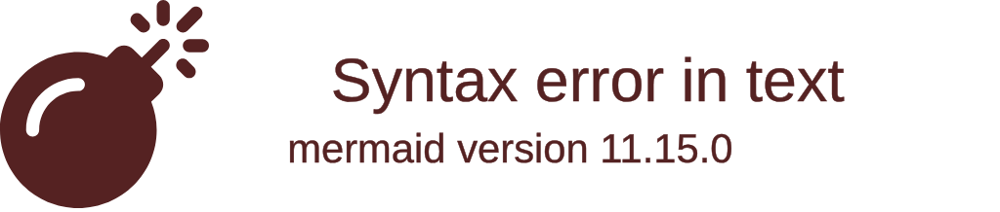

  <!-- HERO BANNER PLACEHOLDER (Replace with docs/assets/hero-banner.svg) -->
  

   

  <h1>VibePulse</h1>
  
<strong>The Engineering Search & Investigation Engine</strong>

  
Observe First. Derive Carefully. Never Invent.

  

    
    
    
  

   

  <!-- HERO SCREENSHOT PLACEHOLDER -->
  <!-- Recommendation: Insert `docs/assets/hero-replay-engine.png` here (1440x900) -->
  

 

**VibePulse** is a deterministic, event-driven observation platform for software engineering. It acts as an investigation engine, allowing you to discover, filter, correlate, and navigate your engineering activity natively.

It does **not** generate code, nor does it replace Git or CI/CD. Instead, it provides a high-fidelity "Time Machine" and "Engineering DNA" to understand the _process_ of how your code evolves.

---

## ⚡ Key Capabilities

### 🎥 The Replay Engine

Play back coding sessions exactly as they happened. VibePulse automatically segments long sessions into semantic chapters (`WORK`, `IDLE_GAP`, `LANGUAGE_SWITCH`).

<!-- GIF PLACEHOLDER -->
<!-- Recommendation: Insert `docs/assets/demo-replay-engine.gif` here -->

### 🧬 Engineering DNA (Static Analysis)

Extracts structural architecture (functions, classes, dependencies, security TODOs) without ever executing the code or sending it to the cloud.

<!-- SCREENSHOT PLACEHOLDER -->
<!-- Recommendation: Insert `docs/assets/engineering-dna.png` here -->

### 🕵️ Investigation Engine

A powerful, Kibana-style search interface to query your engineering history deterministically across all sessions.

### 🤖 AI Provenance

Statistically detect the likelihood of AI-assisted authorship based on typing velocity and AST complexity deltas.

---

## 🏗️ Architecture

VibePulse follows a decoupled, feature-first monorepo architecture:

1. **Daemon (Node.js)**: Runs locally. Detects filesystem events and streams them safely to the API.
2. **API (FastAPI + Python 3.12)**: The brain. Persists events, runs AST/Security Analyzers, and manages session lifecycle.
3. **Dashboard (React + Vite)**: A premium, dark-mode first UI that connects via WebSockets for real-time telemetry.

<!-- ARCHITECTURE DIAGRAM PLACEHOLDER -->
<!-- Recommendation: Render the Mermaid diagram from `docs/diagrams/system-architecture.md` here -->

---

## 🚀 Getting Started

Ready to install VibePulse? Check out our comprehensive guides:

- 📖 [**Installation Guide**](INSTALLATION.md) — Local development and quick start.
- 🚢 [**Deployment Guide**](DEPLOYMENT.md) — How to run VibePulse in production via Docker Compose.
- 🏛️ [**Architecture Reference**](ARCHITECTURE.md) — Deep dive into the monorepo design and decisions.
- 📡 [**API Reference**](API_REFERENCE.md) — Full REST and WebSocket endpoint documentation.

---

## 🤝 Contributing

We welcome contributions! Please see our [Contributing Guide](CONTRIBUTING.md) for details on our conventional commits, monorepo setup, and feature-first architecture rules.

## 🛡️ Security

If you discover a security vulnerability within VibePulse, please review our [Security Policy](SECURITY.md).

## 📄 License

This project is licensed under the MIT License - see the [LICENSE](LICENSE) file for details.
