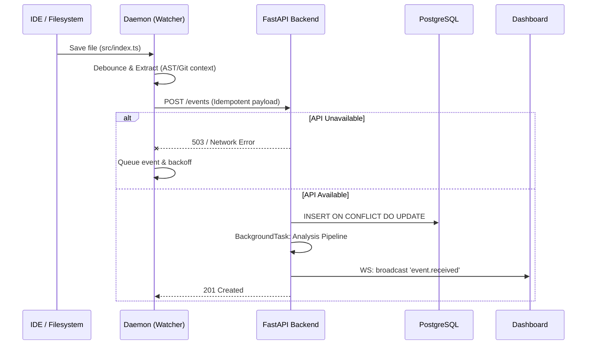

# VibePulse System Design

This document focuses on the operational topology, deployment, and scalability mechanics of VibePulse.

For the deep-dive on code organization and the monorepo structure, see [Architecture Reference](ARCHITECTURE.md).

## Operational Topology

VibePulse is composed of four principal node types:

1. **Observer Nodes (Daemon)**
   - **Runtime**: Node.js `v20+`
   - **Role**: Pure event emission. Runs directly on developer laptops alongside their IDE.
   - **Characteristics**: Ephemeral, unprivileged network edge. Resilient against API downtime through an in-memory queue and automatic retries.

2. **Ingestion & Intelligence API (FastAPI)**
   - **Runtime**: Python 3.12 (uvicorn/gunicorn)
   - **Role**: Validates, persists, and enriches data via AST & Security analyzers.
   - **Characteristics**: Horizontally scalable, entirely stateless.

3. **Data Plane (PostgreSQL & Redis)**
   - **Role**: The source of truth. PostgreSQL stores historical `sessions` and `development_events`. Redis currently manages transient cache (and will broker pub/sub for multiple API replicas in `v1.1`).
   - **Characteristics**: Highly available.

4. **Client Interface (React Dashboard)**
   - **Role**: Consumes the intelligence API via REST & WebSocket.
   - **Characteristics**: Jamstack compatible, edge-cacheable.

## Data Flow & Resilience

### Idempotency & Fault Tolerance

The Daemon operates on an unreliable network edge (a developer laptop closing and opening). To ensure integrity:

1. **At-Least-Once Delivery**: The daemon retries failed uploads indefinitely with exponential backoff.
2. **Idempotent Ingestion**: PostgreSQL strictly enforces `UNIQUE(session_id, file_path, event_type, timestamp)`. If the API receives a duplicate event due to a retry over an interrupted network connection, the API returns a `200 OK` rather than duplicating the row.

## Concurrency and Scaling

The backend API is completely asynchronous (`asyncio`).

- **Session Management**: Session finalization (from `IDLE` to `COMPLETED`) is performed via a background sweep loop.
- **Analysis Pipeline**: CPU-heavy tasks like `StaticAnalysis` (AST parsing) are dispatched using FastAPI's `BackgroundTasks`, keeping the HTTP ingress latency sub-20ms.

> **Production Note for v1.0.0**: The session finalization sweep loop runs in-memory within the Uvicorn process. You can confidently run one instance. If you choose to scale the API horizontally behind a load balancer, note that multiple instances will run the sweep loop concurrently. Because PostgreSQL enforces strict state constraints, this will not corrupt data, but it is technically redundant. A Redis-backed distributed lock is scheduled for the v1.1 scaling update.
