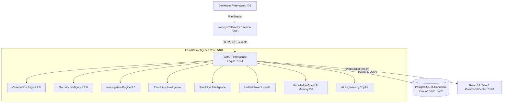

# VibePulse — System Architecture Specification

**Status**: Authoritative Architecture Specification
**Architecture Freeze**: Active
**Canonical Source of Truth**: PostgreSQL 16+ Historical Telemetry
**Deterministic Invariant**: Pure Derived Projections ($A \equiv B$)
**Dedicated Port Namespace**: API `5184` | Dashboard `5183` | Daemon `5185` | PostgreSQL `5432`

---

## 1. Architectural Mission & Principles

VibePulse is a deterministic, event-driven engineering intelligence and investigation platform. It provides an end-to-end continuous loop from passive filesystem telemetry to causal root cause investigation, predictive risk forecasting, semantic knowledge graph traversal, and zero-hallucination AI Copilot assistance.

### Core Architectural Principles

1. **Passive Observation**: VibePulse never writes, suggests, or modifies user source code. It passively observes filesystem mutations, AST changes, and developer session boundaries.
2. **PostgreSQL as Single Source of Truth**: All metrics, graphs, incidents, and copilot answers are pure deterministic projections over immutable PostgreSQL records. There are zero duplicate in-memory state machines.
3. **Deterministic Reconstructibility ($A \equiv B$)**: Replaying the canonical event log yields an exact, bit-for-bit identical state for health scores, causal DAGs, knowledge graphs, and resolution histories.
4. **Secret Redaction by Design**: AST parsers mask sensitive credentials matching secret patterns to `[REDACTED]` before persistence and presentation.
5. **Multi-Project Isolation**: Telemetry, health states, and context for Project A are 100% segregated from Project B.
6. **Zero-LLM Dependency**: The AI Copilot operates via deterministic AST classification, structured semantic retrieval, and tri-state provenance (`[OBSERVED]`, `[INFERRED]`, `[UNKNOWN]`) without external cloud LLM dependencies.

---

## 2. High-Level System Architecture



---

## 3. The 10-Stage Canonical Intelligence Pipeline

```
OBSERVE ──▶ DETECT ──▶ UNDERSTAND ──▶ INVESTIGATE ──▶ RESOLVE ──▶ LEARN ──▶ PREDICT ──▶ ASK ──▶ ACT ──▶ MEMORY
```

1. **OBSERVE** (`apps/daemon`): Local filesystem watcher captures file additions, edits, and deletions via Chokidar with 300ms debouncing and SHA-256 content hashing.
2. **DETECT** (`app/features/analysis`): Tree-Sitter & Python AST static inspection extracts syntactic diffs and triggers deterministic rules (`SEC001`, `DEBUG_TRUE`).
3. **UNDERSTAND** (`app/features/security`): Quantifies security risk contribution points and maps vulnerabilities to specific file paths with secret redaction (`[REDACTED]`).
4. **INVESTIGATE** (`app/features/investigation`): Constructs a causal Directed Acyclic Graph (DAG) connecting session activity, file changes, AST findings, and project health degradation.
5. **RESOLVE** (`app/features/resolution`): Triage state transitions (`OPEN` $\to$ `INVESTIGATING` $\to$ `REVIEWED` $\to$ `RESOLVED`) with reviewer attribution and resolution notes.
6. **LEARN** (`app/features/resolution`): Records immutable audit trail in `incident_review_history` for compliance and retrospective memory.
7. **PREDICT** (`app/features/predictive_intelligence`): Computes empirical churn velocity, code acceleration slope, focus drift, and regression risk.
8. **ASK** (`app/features/copilot`): Evaluates natural engineering queries across 16 canonical families using grounded tri-state facts (`[OBSERVED]`, `[INFERRED]`, `[UNKNOWN]`) and an Answerability Gate.
9. **ACT** (`app/features/project_health`): Closed-loop recovery where developer actions dynamically recalculate the Metric Triad (`Health Score`, `Security Risk Score`, `Forecast Strength`).
10. **MEMORY** (`app/features/knowledge_graph`, `app/features/project_context`): Materializes multi-entity Knowledge Graph and exports portable `PROJECT_CONTEXT.md` for downstream AI agents.

---

## 4. PostgreSQL Canonical Data Model

All intelligence is derived from 7 canonical tables in PostgreSQL:

| Table                     | Purpose / Contents                                                                                                   |
| ------------------------- | -------------------------------------------------------------------------------------------------------------------- |
| `projects`                | Registered project metadata, display names, and canonical root paths on disk.                                        |
| `sessions`                | Contiguous developer activity sessions (`ACTIVE` $\to$ `IDLE` $\to$ `COMPLETED`).                                    |
| `development_events`      | Immutable raw event stream (`FILE_MODIFIED`, `FILE_CREATED`, `FILE_DELETED`) with relative paths and SHA-256 hashes. |
| `event_analyses`          | AST static analysis findings, language tags, and security violations.                                                |
| `project_contexts`        | Persistent project memory, active subsystem configurations, and settings.                                            |
| `incident_review_states`  | Current review state (`OPEN`, `RESOLVED`, etc.) and reviewer assignments.                                            |
| `incident_review_history` | Immutable transition log of all state and review modifications.                                                      |

---

## 5. Subsystem Architecture

### A. Observation Engine 2.0 (`apps/daemon`)

- **Runtime**: Node.js 22 + TypeScript + Chokidar.
- **Port**: `5185` (`http://localhost:5185/health`).
- **Functionality**: Observes filesystem mutations, debounces rapid writes, manages observation gates, registers project roots with the API, and delivers telemetry payloads via HTTP POST.

### B. Security Intelligence 2.0 (`app/features/security`)

- **Analyzers**: AST static inspection rules for hardcoded credentials (`SEC001`), insecure flags (`DEBUG_TRUE`), and environment credential exposures.
- **Redaction**: Strict string replacement replacing captured secret tokens with `[REDACTED]` prior to persistence and JSON serialization.

### C. Investigation Engine 3.0 (`app/features/investigation`)

- **Capabilities**: Reconstructs causal Directed Acyclic Graphs (DAGs) linking sessions $\to$ file mutations $\to$ AST findings $\to$ health impact.
- **Explainability**: Mathematical 5-dimension score decomposition ($W_i \times S_i$) explaining exact point deductions.

### D. Incident Resolution Intelligence (`app/features/resolution`)

- **State Machine**: `OPEN` $\to$ `INVESTIGATING` $\to$ `MITIGATING` $\to$ `REVIEWED` $\to$ `RESOLVED` (or `FALSE_POSITIVE`).
- **Audit Persistence**: Every transition is stored in `incident_review_history` with timestamp, reviewer name, previous state, new state, and triage notes.

### E. Unified Project Health & Metric Triad (`app/features/project_health`)

- **Overall Health Score** ($0\dots 100$, Higher=Better):
  $$\text{Health} = 0.30 \times S_{\text{sec}} + 0.25 \times S_{\text{stab}} + 0.20 \times S_{\text{inc}} + 0.15 \times S_{\text{res}} + 0.10 \times S_{\text{pred}}$$
- **Security Risk Score** (Points, Higher=Worse): Direct sum of unmitigated AST security finding weights.
- **Forecast Strength** ($0\dots 100$, Empirical Baseline): Statistical confidence tier based on observation history length and commit velocity.

### F. Predictive Engineering Intelligence (`app/features/predictive_intelligence`)

- **Statistical Model**: Evaluates churn velocity slope, focus drift across directories, and recurring file modification hotspots without ungrounded black-box ML models.

### G. Engineering Knowledge Graph & Project Memory 2.0 (`app/features/knowledge_graph`)

- **Graph Topology**: Directed semantic graph with nodes (`FILE`, `SUBSYSTEM`, `SECURITY_RULE`, `INCIDENT`, `SESSION`) and edges (`CONTAINS`, `BELONGS_TO`, `AFFECTS`, `RESOLVED_BY`, `SUPPORTS`).
- **AI Handoff**: Generates complete `PROJECT_CONTEXT.md` containing ground truth state for downstream developer tooling.

### H. AI Engineering Copilot Foundation (`app/features/copilot`)

- **Query Families (16)**: `PROJECT_HEALTH`, `TOP_PRIORITY`, `RECENT_CHANGES`, `SECURITY_FINDINGS`, `FILE_ANALYSIS`, `SUBSYSTEM_ANALYSIS`, `INCIDENT_INVESTIGATION`, `RESOLUTION_HISTORY`, `PREDICTIVE_RISK`, `CHURN_HOTSPOTS`, `DEPENDENCY_GRAPH`, `DEVELOPER_ACTIVITY`, `TIMELINE_SUMMARY`, `AI_CONTEXT_EXPORT`, `SYSTEM_ARCHITECTURE`, `HEALTH_DIMENSIONS`.
- **Tri-State Provenance**: Every statement tagged `[OBSERVED]`, `[INFERRED]`, or `[UNKNOWN]`.
- **Answerability Gate**: Cleanly rejects out-of-scope queries (market prices, weather, elections, private emails) without hallucination.

### I. Frontend Command Center (`apps/dashboard`)

- **Runtime**: React 18 + Vite 6 + TypeScript + Tailwind CSS.
- **Port**: `5183` (`http://localhost:5183`).
- **Capabilities**: Real-time WebSocket telemetry stream (`/ws/events`, `/ws/sessions`), Metric Triad cards, interactive Causal Evidence Graph, Knowledge Graph visualization, and embedded Copilot mini-console.

---

## 6. Port Namespace & Operational Mapping

| Component                    | Port       | Default URL                    | Purpose                              |
| ---------------------------- | ---------- | ------------------------------ | ------------------------------------ |
| **FastAPI Backend (API)**    | **`5184`** | `http://localhost:5184`        | REST & WebSocket intelligence engine |
| **FastAPI Interactive Docs** | **`5184`** | `http://localhost:5184/docs`   | OpenAPI / Swagger specification      |
| **React Dashboard (UI)**     | **`5183`** | `http://localhost:5183`        | Vite dev server & Command Center UI  |
| **Telemetry Daemon**         | **`5185`** | `http://localhost:5185/health` | Filesystem watcher & health server   |
| **PostgreSQL Database**      | **`5432`** | `localhost:5432`               | Canonical source of truth            |
| **Redis Cache / PubSub**     | **Cloud**  | Configured URI                 | Cloud Redis instance                 |

---

## 7. Quality & Verification Invariants

- **Determinism**: State is 100% reconstructible ($A \equiv B$).
- **Test Suite**: 348 Backend Pytest + 130 Daemon Vitest tests passing.
- **Multi-Project Isolation**: Tenant telemetry is completely partitioned by `project_id`.
- **Safe Lifecycle**: Project deletion removes only VibePulse telemetry database records; source code on disk is never modified or deleted.
