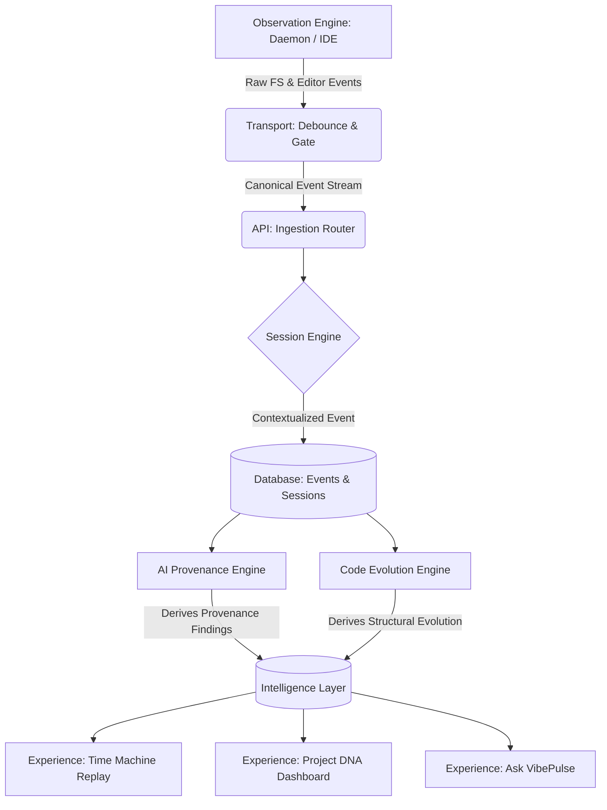

# VibePulse 2.0: Master Architecture Blueprint

**The Observability Platform for AI-Assisted Software Development**

---

## 1. Product Vision

### The Thesis

Modern software development has fundamentally changed. Code is no longer just typed; it is generated, prompted, copy-pasted from AI assistants, and refactored by autonomous agents.

However, our tooling has not caught up.

- **Git** tells us _WHAT_ changed (the snapshot).
- **GitHub** tells us _WHO_ committed it (the collaboration).
- **CI/CD** tells us _WHETHER_ it works (the verification).
- **VibePulse** tells us **HOW** software came into existence (the evolution).

VibePulse 2.0 is not a "file activity dashboard"—it is an entirely new category: **Development Observability & Provenance**. It bridges the gap between discrete Git commits by continuously observing the micro-transitions of the codebase. It answers the fundamental question: _How did we get from Commit A to Commit B?_

### The Unique Value Proposition

With the rise of AI coding assistants (Copilot, Cursor, Claude Code), it is increasingly critical to understand the _provenance_ of code. Was this file methodically typed by a human, instantly pasted from a ChatGPT window, or iteratively generated by an autonomous agent? VibePulse observes the continuous stream of development to capture this ground truth, providing unprecedented visibility into software engineering velocity, friction, and origin.

---

## 2. Core Product Philosophy

Every system, engine, and feature in VibePulse 2.0 must obey these strict, non-negotiable principles:

1. **Truth Boundary:** Intelligence must be derived entirely from persisted, deterministic telemetry (filesystem events, keystroke pacing, process observation). We do not assume; we observe.
2. **Evidence First:** Every chart, metric, and insight must have a traceable lineage back to raw, immutable events.
3. **Deterministic before AI:** Use deterministic algorithms (AST parsing, edit distance, pacing heuristics) to analyze code evolution before introducing LLM-based speculation.
4. **Local First & Privacy First:** Telemetry never leaves the user's local machine unless explicitly synchronized to a trusted, user-owned remote. Code is private.
5. **No Fake Intelligence:** We do not invent abstract concepts like "Developer Productivity" or "Code Quality" without explicit, mathematical definitions. We measure friction, rework, and provenance.
6. **Explainability:** If we claim an architecture is degrading or a file is a bottleneck, the user must be able to click through to the exact sessions and events that prove it.

---

## 3. System Architecture

VibePulse 2.0 transitions to a layered, decoupled architecture designed to scale from local process observation to longitudinal intelligence.

### 1. Observation Layer (The Edge)

- **Role:** Lives entirely on the developer's machine (Daemon, IDE Extensions).
- **Responsibility:** Captures high-fidelity, low-level telemetry (file edits, IDE focus, clipboard events, process lifecycles).
- **Key Constraint:** Must have near-zero performance impact on the developer's machine.

### 2. Transport & Normalization Layer (The Nervous System)

- **Role:** The pipeline from the Edge to the Brain.
- **Responsibility:** Buffers, debounces, sanitizes, and normalizes disparate raw events into a canonical `DevelopmentEvent` schema.

### 3. Analysis & Intelligence Layer (The Brain)

- **Role:** The backend stream processor (FastAPI / Python Engine).
- **Responsibility:** Processes normalized events into higher-order contexts. Groups events into Sessions, detects structural refactoring, and categorizes code provenance (Human vs. AI).

### 4. Data Layer (The Memory)

- **Role:** The immutable ledger (PostgreSQL).
- **Responsibility:** Persists the chronological truth of the project. Optimized for both deep time-series queries and relational entity traversal.

### 5. Experience Layer (The Glass)

- **Role:** The visualization surface (React/TypeScript Dashboard).
- **Responsibility:** Translates longitudinal data into signature visual experiences (Replays, Pulses, Heatmaps).

---

## 4. Intelligence Engines

To prevent a monolithic backend, VibePulse intelligence is strictly divided into specialized engines.

### 1. Observation Engine

- **Purpose:** The physical interface to reality.
- **Inputs:** Filesystem events (`chokidar`), IDE hooks (future), process signals.
- **Outputs:** Canonical `DevelopmentEvent` stream.
- **Dependencies:** Low-level OS APIs.

### 2. Session Engine

- **Purpose:** Contextualizes time. Establishes the boundaries of reality (When did work start? When did it stop?).
- **Inputs:** `DevelopmentEvent` stream.
- **Outputs:** Normalized `Session` lifecycles and boundaries.
- **Storage:** Relational mapping of events to contiguous blocks of time.

### 3. AI Provenance Engine (The Researcher)

- **Purpose:** Determines _how_ code was written.
- **Inputs:** Event pacing, burst velocity, clipboard injection events.
- **Outputs:** Probability scores and classifications for file segments (e.g., `MANUAL_TYPING`, `AI_GENERATION`, `COPY_PASTE`).
- **Future:** Can detect if a 500-line change appeared in 2 seconds (AI/Paste) vs. incrementally over 2 hours (Human).

### 4. Code Evolution Engine

- **Purpose:** Tracks structural and semantic changes across time, not just string differences.
- **Inputs:** Code snapshots, AST comparisons.
- **Outputs:** Refactoring events, function extractions, logic shifts.

### 5. Project DNA Engine

- **Purpose:** Understands the longitudinal macro-trends of a project.
- **Inputs:** Aggregated session data across weeks/months.
- **Outputs:** Hotspot mapping, architectural friction points, technology stack evolution.

### 6. Time Machine & Replay Engine

- **Purpose:** Cinematic playback of project creation.
- **Inputs:** Historical event stream, Code Snapshots.
- **Outputs:** Deterministic visual playback of the codebase evolving.

### 7. Ask VibePulse Engine

- **Purpose:** Agentic QA over project history.
- **Inputs:** RAG embeddings of sessions, provenance, and evolution data.
- **Outputs:** Natural language answers to questions like "Why was `auth.ts` rewritten last Tuesday?"

---

## 5. Data Model

The VibePulse 2.0 schema shifts from simple logging to a deeply relational observability graph.

- **Project**: The root entity. The canonical software repository.
- **Session**: A continuous window of developer flow. Belongs to a Project.
- **Event**: The atomic unit of truth. Bound to a Session. Contains polymorphic metadata (File Modified, Test Run, App Started).
- **Finding / Intelligence**: Derived data bound to Sessions or Projects (e.g., `ProvenanceClassification`, `FrictionAnomaly`).
- **CodeSnapshot**: A lightweight, deduplicated point-in-time reference of a file's state to enable the Time Machine.
- **AIInteraction**: (Future) Records of prompt references or autonomous agent actions directly mapped to the resulting code events.

---

## 6. Event Flow (The Provenance Pipeline)

---

## 7. Feature Roadmap (Release Orchestration)

We discard arbitrary sprint numbers. The roadmap is categorized by thematic milestones.

### Release 1: The Observability Foundation (Stabilization)

- **Goal:** Bulletproof, zero-loss telemetry pipeline.
- **Features:** Graceful session termination, resilient local DB mapping, robust debouncing, exact project canonicalization.
- **Complexity:** Medium.
- **Risk:** High volume event loss causing inaccurate baseline data.
- **Estimated Duration:** 2 Weeks.

### Release 2: Structural Provenance (The Differentiator)

- **Goal:** Differentiate human typing from AI generation.
- **Features:** Burst-event detection, pacing heuristics, "Copy-Paste vs Typing" classification metrics, AI Provenance visual overlays.
- **Complexity:** High (Algorithm Design).
- **Risk:** False positives in classification angering users.
- **Estimated Duration:** 4 Weeks.

### Release 3: The Time Machine (The Visual Hook)

- **Goal:** Cinematic playback of development.
- **Features:** Session Replay UI, timeline scrubber, code-evolution diff playback, integration of snapshots.
- **Complexity:** Very High (Frontend State Management).
- **Risk:** Browser memory limits when replaying thousands of DOM changes.
- **Estimated Duration:** 4 Weeks.

### Release 4: Project DNA (The CTO View)

- **Goal:** Longitudinal insights across months of work.
- **Features:** Friction hotspots, Session Pulse signature visualization, architectural rework metrics across the entire repo lifespan.
- **Complexity:** Medium.
- **Risk:** Dashboard genericism (must remain distinct from GitHub Insights).
- **Estimated Duration:** 3 Weeks.

### Release 5: Ask VibePulse (The Intelligence Layer)

- **Goal:** Conversational interface grounded in _how_ code was built.
- **Features:** Vectorized event histories, RAG integration, chat UI.
- **Complexity:** High.
- **Risk:** Hallucinations that violate the Core Product Philosophy (Truth Boundary).
- **Estimated Duration:** 4 Weeks.

---

## 8. Research Contribution (Academic Impact)

VibePulse is uniquely positioned as a tool for empirical software engineering research in the LLM era.

### Novel Contribution

- **Development Provenance in the Era of LLMs:** Creating the first public dataset and tooling to empirically measure how AI coding assistants alter the micro-behaviors of software engineering.

### Potential Experiments & Questions

1.  **Velocity vs. Rework:** Does code generated in massive bursts (AI) require more micro-refactoring events in subsequent sessions than code typed manually?
2.  **The Context Context:** Do developers spend more time reading (idle observation) than writing when interacting with AI tooling compared to traditional development?
3.  **Heuristic Authorship:** Can keystroke dynamics and file-system event pacing accurately classify code as Human vs. LLM with >95% precision?

### Evaluation Metrics

- **Precision & Recall** of the AI Provenance Engine against self-reported ground truth datasets.
- **Confusion Matrix** of `Human-Typed` vs `AI-Pasted` vs `Agent-Generated`.
- **F1 Score** for identifying AI-assisted architectural degradation.

---

## 9. Signature Features (The "Wow" Factor)

These are the features that break the mold of a "dashboard" and create a new category.

1.  **The Code Genesis Replay:** A cinematic, scrubbable playback of a file's creation. Not a Git diff, but the actual real-time evolution, showing the pauses, the deletions, and the sudden bursts of code. _Demo Value: Extremely High._
2.  **The AI Provenance Heatmap:** A visual overlay on the project directory coloring files based on their origin: Blue for methodically typed, Purple for heavily copy-pasted, Orange for agent-generated bursts. _Technical Impressiveness: Differentiates based on behavioral metadata, not static text._
3.  **The Friction Pulse:** A longitudinal chart that identifies exactly which files require constant, painful rework across dozens of sessions—highlighting technical debt through behavioral data rather than arbitrary static analysis rules.
4.  **The Copy-Paste Lineage:** Trace a block of code backward through time to the exact session and event where it was first introduced, proving its origin.
5.  **The "Why Did This Break?" Time Machine:** Instead of git bisect, instantly jump to the exact session where a specific function was rewritten, viewing the telemetry and pace of the developer who made the change.

---

## 10. Competitive Analysis

Why VibePulse isn't just another dev tool:

| Competitor                 | What They Do                                       | VibePulse's Unique Differentiator                                                                                 |
| :------------------------- | :------------------------------------------------- | :---------------------------------------------------------------------------------------------------------------- |
| **Git / GitHub**           | Snapshots state at discrete, intentional moments.  | Observes the continuous _flow_ between those moments.                                                             |
| **Cursor / Copilot**       | Generates code via LLMs.                           | Observes _how_ that generated code is actually integrated and refactored. We are the observer to their generator. |
| **SonarQube / CodeQL**     | Analyzes static code for bugs and security issues. | Analyzes the _behavioral_ process of writing the code (velocity, friction).                                       |
| **WakaTime**               | Tracks time spent in IDEs per language.            | Tracks structural intent, rework, and provenance, not just a stopwatch.                                           |
| **Sentry / OpenTelemetry** | Observes application runtime performance.          | Observes the _software development lifecycle_ performance.                                                        |

---

## 11. Risks & Anti-Patterns (What NOT to build)

1.  **The Fake AI Trap:** Do not build a generic LLM wrapper that says "Your code is 20% better today." If we cannot prove it mathematically with telemetry, we do not ship it.
2.  **The Big Brother Trap:** VibePulse is for team enablement and self-reflection. If it becomes a tool for managers to track "keystrokes per minute," the product fails. Focus on codebase health, not developer surveillance.
3.  **The Performance Tax:** If the daemon slows down the user's compilation or IDE, they will uninstall it instantly. The Observation Layer must remain completely invisible and asynchronous.
4.  **The Dashboard Clutter:** Avoid generic pie charts of "Languages Used." Every visual must tell a story about time, evolution, or friction.
5.  **Over-Engineering Intelligence without Ground Truth:** Building complex ML models to detect "refactoring" before we have a solid dataset of confirmed refactoring events. We must build deterministic heuristics first.
