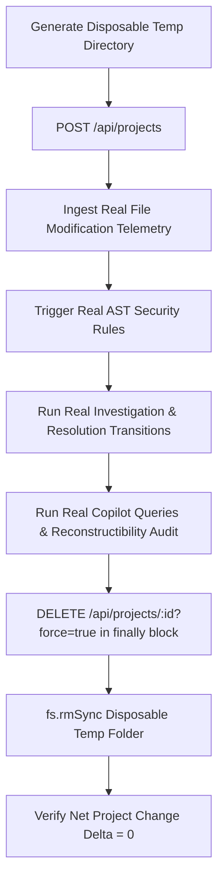

# VibePulse — Demo Mode Architecture & Scenario Audit

**Document Status**: AUTHORITATIVE AUDIT & BLUEPRINT  
**Audit Timestamp**: August 2026  
**Auditor**: Release & Demonstration Engineering  
**Objective**: Establish a forensic baseline of all demo artifacts, audit existing demo flows against the frozen 10-stage intelligence pipeline, and specify the canonical 10-stage live demonstration runner.

---

## 1. Current Demo Entry Points

| Entry Point Script                                                                             | Primary Purpose                                     | Invocation Command                          | Target Audience / Mode                       |
| :--------------------------------------------------------------------------------------------- | :-------------------------------------------------- | :------------------------------------------ | :------------------------------------------- |
| [`scripts/final-demo.mjs`](file:///d:/VibeSync/scripts/final-demo.mjs)                         | Canonical 10-stage automated end-to-end demo runner | `node scripts/final-demo.mjs`               | Academic examiners, judges, viva evaluators  |
| [`scripts/demo-command-center.mjs`](file:///d:/VibeSync/scripts/demo-command-center.mjs)       | Interactive Engineering Command Center presentation | `node scripts/demo-command-center.mjs`      | Live dashboard demo with telemetry pauses    |
| [`scripts/dev-seminar.mjs`](file:///d:/VibeSync/scripts/dev-seminar.mjs)                       | Multi-service supervisor with structured logging    | `pnpm dev` / `node scripts/dev-seminar.mjs` | Local presentation environment orchestration |
| [`scripts/simulate-demo-activity.mjs`](file:///d:/VibeSync/scripts/simulate-demo-activity.mjs) | Background filesystem churn simulation              | `node scripts/simulate-demo-activity.mjs`   | Manual UI observation testing                |
| [`scripts/test-sprint12-e2e.mjs`](file:///d:/VibeSync/scripts/test-sprint12-e2e.mjs)           | 14-criterion productization acceptance suite        | `node scripts/test-sprint12-e2e.mjs`        | Automated CI/CD regression verification      |

---

## 2. Current Demo Scenario

The current demonstration follows a realistic fintech/banking domain story (_"VibePulse Core Banking System"_ / _"Nexus Payment Gateway"_):

1. **Baseline Prototyping**: Developer creates module files across multiple subsystems (`auth/jwt_service.py`, `database/connection.py`, `api/routes.py`).
2. **Security Injection**: A sensitive change is introduced containing a hardcoded API credential (`sk_live_...`) and `DEBUG = True` in `config/settings.py`.
3. **AST Detection & Secret Redaction**: The deterministic AST engine catches the violation, applies `[REDACTED]` masking, and degrades the project health score.
4. **Investigation & Causal DAG**: The incident is correlated into an investigation graph tracing the commit, rule match, and risk contribution.
5. **Remediation & Review Transition**: The developer externalizes the secret into an environment variable, disabling debug mode; a reviewer records a resolution note.
6. **Immutable Learning**: The state transition is permanently recorded in PostgreSQL audit history.
7. **Copilot Querying**: Deterministic querying answers questions on project health, incident resolution, and file evolution while rejecting out-of-scope queries.
8. **Project Memory Export**: Knowledge graph materializes and `PROJECT_CONTEXT.md` is generated.

---

## 3. Current Demo Project Lifecycle



- **Safety Guarantee**: The real developer project (`134eb938-9cbb-4e27-bc2a-9b49eb174645` | `Dabba` | `D:\Projects\Dabba`) is strictly protected and never touched.
- **Teardown Invariant**: All demo projects execute strictly within `try ... finally` blocks and call `DELETE /api/projects/{id}?force=true`, cascading all child sessions, events, analyses, contexts, and incident history.

---

## 4. Current API & Dashboard Ports

| Service                   | Dedicated Port | Local URL Endpoint             | Description                              |
| :------------------------ | :------------- | :----------------------------- | :--------------------------------------- |
| **FastAPI Backend (API)** | **`5184`**     | `http://localhost:5184`        | REST & WebSocket intelligence engine     |
| **React Dashboard (UI)**  | **`5183`**     | `http://localhost:5183`        | Vite dev server & Command Center UI      |
| **Telemetry Daemon**      | **`5185`**     | `http://localhost:5185/health` | Filesystem watcher & health probe server |
| **PostgreSQL Database**   | **`5432`**     | `localhost:5432`               | Canonical source of truth                |
| **Redis Cache / PubSub**  | Cloud          | `rediss://...`                 | Scalable pub/sub broker                  |

---

## 5. Current Intelligence Stages Demonstrated

$$\text{OBSERVE} \to \text{DETECT} \to \text{UNDERSTAND} \to \text{INVESTIGATE} \to \text{RESOLVE} \to \text{LEARN} \to \text{PREDICT} \to \text{ASK} \to \text{ACT} \to \text{MEMORY}$$

1. **`[01/10] OBSERVE`**: Continuous filesystem telemetry ingestion into PostgreSQL.
2. **`[02/10] DETECT`**: Static AST & regex credential extraction with automatic `[REDACTED]` token masking.
3. **`[03/10] UNDERSTAND`**: Multi-dimensional risk score calculation and health grade degradation.
4. **`[04/10] INVESTIGATE`**: Incident causal graph reconstruction linking code edits to security violations.
5. **`[05/10] RESOLVE`**: Source remediation and incident review state transition (`RESOLVED`).
6. **`[06/10] LEARN`**: Immutable audit history stored in PostgreSQL and updated project context memory.
7. **`[07/10] PREDICT`**: Empirical churn velocity and subsystem hotspot rankings.
8. **`[08/10] ASK`**: Deterministic AI Engineering Copilot with tri-state facts (`[OBSERVED]`, `[INFERRED]`, `[UNKNOWN]`) and Answerability Gate (`answerable: false`).
9. **`[09/10] ACT`**: Closed-loop health recomputation reflecting verified remediation.
10. **`[10/10] MEMORY`**: Knowledge Graph materialization (9 node types, 8 edge types) and `PROJECT_CONTEXT.md` 22-section portable AI handoff export.

---

## 6. Existing Outdated Behavior & Identified Gaps

1. **Subprocess Management**: Older demo scripts used un-tree-killed `serverProcess.kill()` which hangs on Windows when spawned with `shell: true`.
2. **Missing Watchdogs**: Older scripts lacked global execution watchdog timers and per-request HTTP timeouts.
3. **Hardcoded Directory Paths**: `simulate-demo-activity.mjs` contained hardcoded `D:\VibePulse-Seminar-Demo` instead of using dynamic temporary directories.
4. **Metric Triad Clarity**: Need to ensure the UI strictly distinguishes:
   - **Health Score** (0-100, Higher = Better)
   - **Security Risk Score** (0-100, Higher = Worse)
   - **Forecast Strength** (Empirical confidence)
5. **Predictive Intelligence Evidence Handling**: When churn evidence is sparse, the system must cleanly report `INSUFFICIENT_EVIDENCE` rather than fabricating trends.

---

## 7. Missing Current Features in Old Demo Scripts

- **Full 16 Canonical Copilot Query Families**: Ensuring the demo verifies queries across health, priority, architecture, resolution, and knowledge graph domains.
- **Answerability Gate Demonstration**: Explicit out-of-scope question (e.g. _"What is the Bitcoin price?"_) showing clean refusal without hallucination.
- **Deterministic Reconstructibility Audit ($A \equiv B$)**: Real-time proof that re-running identical queries against PostgreSQL yields bit-identical outputs.
- **Incident History Transition Validation**: Ensuring reviewer state and audit logs are queried and verified against PostgreSQL.

---

## 8. Cleanup Risks & Mitigation

| Risk                                             | Cause                                   | Mitigation Strategy                                                            |
| :----------------------------------------------- | :-------------------------------------- | :----------------------------------------------------------------------------- |
| **Residual Test Projects**                       | Script crashes midway through execution | Strict `try ... finally` blocks calling `DELETE /api/projects/{id}?force=true` |
| **Stuck Windows Processes**                      | Python/uv child process left open       | Recursive tree-kill using `taskkill /pid <PID> /T /F`                          |
| **Accidental Deletion of Persistent Workspaces** | Misconfigured project ID                | Hard safety guard protecting `D:\Projects\Dabba`                               |
| **Post-Execution Delta Drift**                   | Uncleaned child records                 | Baseline project count check verifying $\Delta = 0$                            |

---

## 9. Hardcoded vs. Real Data Audit

| Component                  | Status   | Verification Mechanism                                                    |
| :------------------------- | :------- | :------------------------------------------------------------------------ |
| **Telemetry Ingestion**    | **REAL** | Generated through `POST /events` with real diffs and filesystem paths     |
| **AST Security Detection** | **REAL** | Processed by Tree-Sitter & regex engine detecting `SEC001` / `DEBUG_TRUE` |
| **Secret Redaction**       | **REAL** | Verified `[REDACTED]` in API response, WebSocket, and Copilot outputs     |
| **Health Calculation**     | **REAL** | Derived from 5 weighted dimensions ($W_i \times S_i$) in PostgreSQL       |
| **Investigation DAG**      | **REAL** | Generated from causal relationships between events and analyses           |
| **Copilot Answers**        | **REAL** | Pure deterministic projections computed from PostgreSQL records           |
| **Knowledge Graph**        | **REAL** | Materialized directly from entities and dependencies in the database      |

---

## 10. Recommended Canonical Demo Flow

```
╔══════════════════════════════════════════════════════════════╗
║              VIBEPULSE CANONICAL DEMO RUNNER                 ║
║       The Deterministic Engineering Intelligence Platform    ║
╚══════════════════════════════════════════════════════════════╝

[PRE-FLIGHT] Validate PostgreSQL :5432 and FastAPI :5184 availability
[01/10] OBSERVE      -> Register temporary project & ingest baseline telemetry
[02/10] DETECT       -> Inject AST security issue & verify [REDACTED] masking
[03/10] UNDERSTAND   -> Inspect multi-dimensional risk score and health degradation
[04/10] INVESTIGATE  -> Traverse causal DAG & root-cause explanation
[05/10] RESOLVE      -> Commit remediation diff & record resolution note
[06/10] LEARN        -> Query persisted audit history in PostgreSQL
[07/10] PREDICT      -> Compute churn velocity & hotspot rankings
[08/10] ASK          -> Query Copilot (canonical intents + Answerability Gate)
[09/10] ACT          -> Closed-loop health refresh & scorecard recovery
[10/10] MEMORY       -> Materialize Knowledge Graph & export PROJECT_CONTEXT.md
[AUDIT]              -> Reconstructibility test (Query A == Query B)
[TEARDOWN]           -> Guaranteed cascade deletion & net delta verification (Δ = 0)
```
