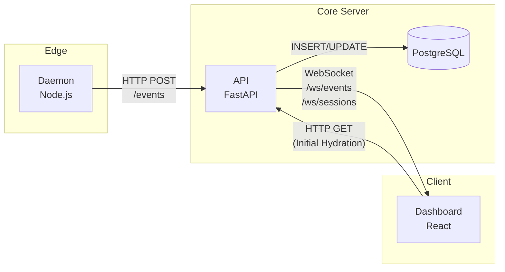

```mermaid
flowchart LR
    subgraph Edge
        D[Daemon\nNode.js]
    end

    subgraph Core Server
        A[API\nFastAPI]
        DB[(PostgreSQL)]
    end

    subgraph Client
        UI[Dashboard\nReact]
    end

    D -- "HTTP POST\n/events" --> A
    A -- "INSERT/UPDATE" --> DB
    A -- "WebSocket\n/ws/events\n/ws/sessions" --> UI
    UI -- "HTTP GET\n(Initial Hydration)" --> A
```
