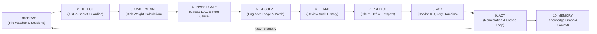

# VibePulse Canonical Intelligence Pipeline

```mermaid
flowchart LR
    OBSERVE["1. OBSERVE\n(File Watcher & Sessions)"]
    DETECT["2. DETECT\n(AST & Secret Guardian)"]
    UNDERSTAND["3. UNDERSTAND\n(Risk Weight Calculation)"]
    INVESTIGATE["4. INVESTIGATE\n(Causal DAG & Root Cause)"]
    RESOLVE["5. RESOLVE\n(Engineer Triage & Patch)"]
    LEARN["6. LEARN\n(Review Audit History)"]
    PREDICT["7. PREDICT\n(Churn Drift & Hotspots)"]
    ASK["8. ASK\n(Copilot 16 Query Domains)"]
    ACT["9. ACT\n(Remediation & Closed Loop)"]
    MEMORY["10. MEMORY\n(Knowledge Graph & Context)"]

    OBSERVE --> DETECT
    DETECT --> UNDERSTAND
    UNDERSTAND --> INVESTIGATE
    INVESTIGATE --> RESOLVE
    RESOLVE --> LEARN
    LEARN --> PREDICT
    PREDICT --> ASK
    ASK --> ACT
    ACT -->|New Telemetry| OBSERVE
    ACT --> MEMORY
```
