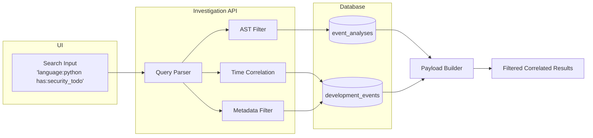

```mermaid
flowchart LR
    subgraph UI
        Query[Search Input\n'language:python has:security_todo']
    end

    subgraph Investigation API
        Parser[Query Parser]
        AST[AST Filter]
        Time[Time Correlation]
        Meta[Metadata Filter]
    end

    subgraph Database
        Events[(development_events)]
        Analyses[(event_analyses)]
    end

    Query --> Parser
    Parser --> AST & Time & Meta
    AST --> Analyses
    Time --> Events
    Meta --> Events

    Analyses & Events --> Builder[Payload Builder]
    Builder --> Output[Filtered Correlated Results]
```
