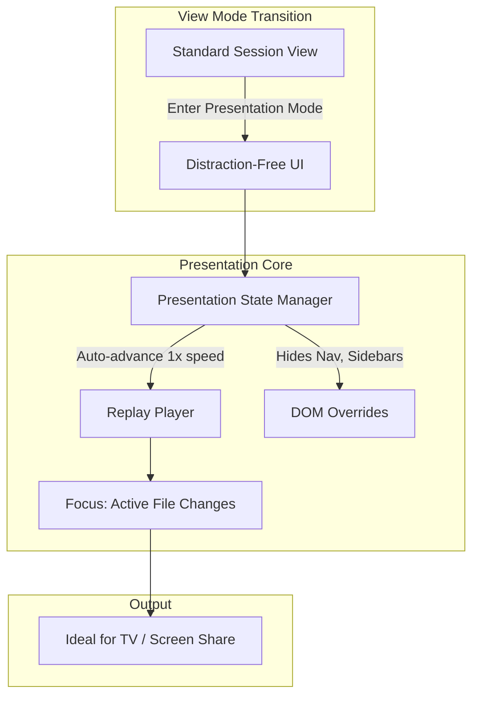

```mermaid
flowchart TD
    subgraph View Mode Transition
        Standard[Standard Session View] -->|Enter Presentation Mode| Clean[Distraction-Free UI]
    end

    subgraph Presentation Core
        Clean --> State[Presentation State Manager]
        State -->|Auto-advance 1x speed| Player[Replay Player]
        State -->|Hides Nav, Sidebars| DOM[DOM Overrides]
        Player --> Frame[Focus: Active File Changes]
    end

    subgraph Output
        Frame --> TV[Ideal for TV / Screen Share]
    end
```
