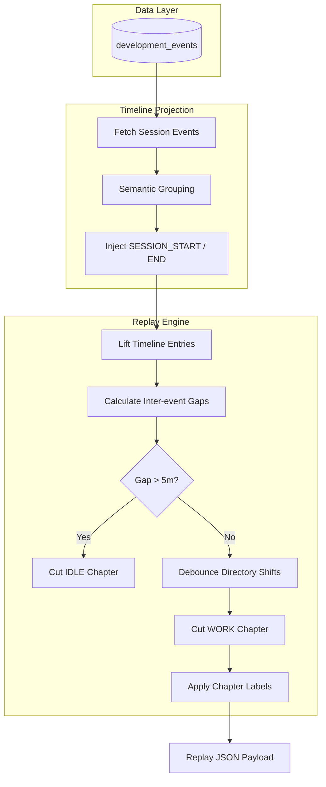

```mermaid
flowchart TD
    subgraph Data Layer
        E[(development_events)]
    end

    subgraph Timeline Projection
        T1[Fetch Session Events]
        T2[Semantic Grouping]
        T3[Inject SESSION_START / END]
    end

    subgraph Replay Engine
        R1[Lift Timeline Entries]
        R2[Calculate Inter-event Gaps]
        R3{Gap > 5m?}
        R4[Cut IDLE Chapter]
        R5[Debounce Directory Shifts]
        R6[Cut WORK Chapter]
        R7[Apply Chapter Labels]
    end

    E --> T1
    T1 --> T2 --> T3
    T3 --> R1
    R1 --> R2
    R2 --> R3
    R3 -- Yes --> R4
    R3 -- No --> R5
    R5 --> R6 --> R7

    R7 --> Output[Replay JSON Payload]
```
