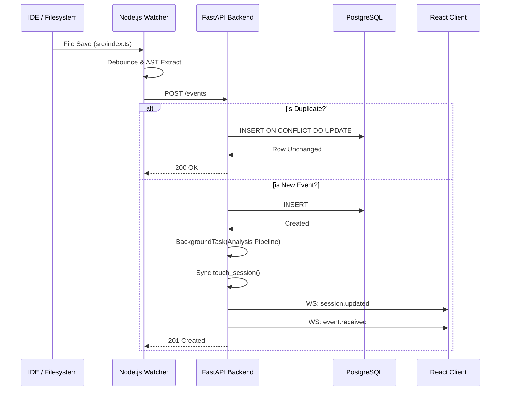

```mermaid
sequenceDiagram
    participant Dev as IDE / Filesystem
    participant Daemon as Node.js Watcher
    participant API as FastAPI Backend
    participant DB as PostgreSQL
    participant Dashboard as React Client

    Dev->>Daemon: File Save (src/index.ts)
    Daemon->>Daemon: Debounce & AST Extract
    Daemon->>API: POST /events

    alt is Duplicate?
        API->>DB: INSERT ON CONFLICT DO UPDATE
        DB-->>API: Row Unchanged
        API-->>Daemon: 200 OK
    else is New Event?
        API->>DB: INSERT
        DB-->>API: Created
        API->>API: BackgroundTask(Analysis Pipeline)
        API->>API: Sync touch_session()
        API->>Dashboard: WS: session.updated
        API->>Dashboard: WS: event.received
        API-->>Daemon: 201 Created
    end
```
