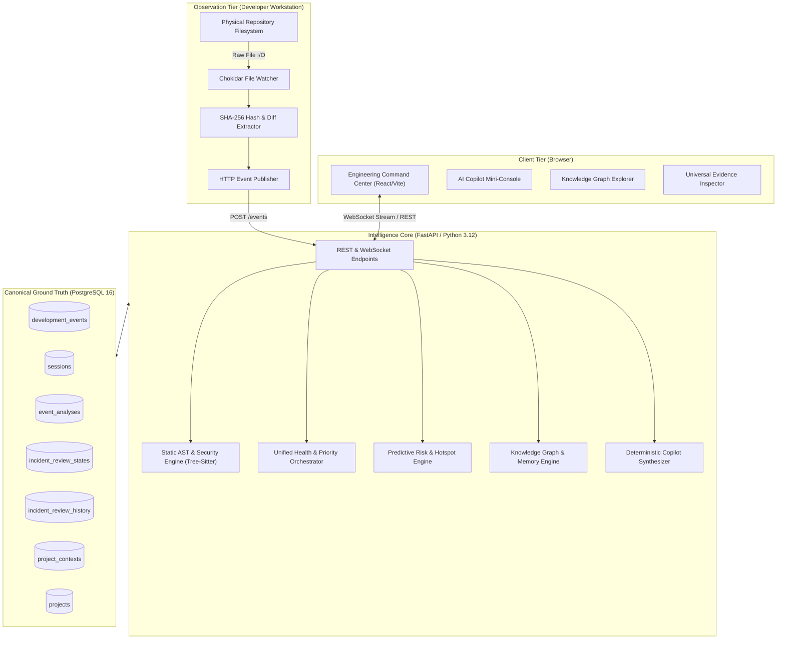

# VibePulse System Architecture Diagram

```mermaid
flowchart TB
    subgraph ClientTier ["Client Tier (Browser)"]
        CC["Engineering Command Center (React/Vite)"]
        CopilotUI["AI Copilot Mini-Console"]
        KGViewer["Knowledge Graph Explorer"]
        EvidenceUI["Universal Evidence Inspector"]
    end

    subgraph DaemonTier ["Observation Tier (Developer Workstation)"]
        FS["Physical Repository Filesystem"]
        Watcher["Chokidar File Watcher"]
        Hasher["SHA-256 Hash & Diff Extractor"]
        Pub["HTTP Event Publisher"]

        FS -->|Raw File I/O| Watcher
        Watcher --> Hasher
        Hasher --> Pub
    end

    subgraph BackendTier ["Intelligence Core (FastAPI / Python 3.12)"]
        Router["REST & WebSocket Endpoints"]
        AST["Static AST & Security Engine (Tree-Sitter)"]
        HealthSvc["Unified Health & Priority Orchestrator"]
        PredSvc["Predictive Risk & Hotspot Engine"]
        KGSvc["Knowledge Graph & Memory Engine"]
        CopilotSvc["Deterministic Copilot Synthesizer"]

        Router --> AST
        Router --> HealthSvc
        Router --> PredSvc
        Router --> KGSvc
        Router --> CopilotSvc
    end

    subgraph StorageTier ["Canonical Ground Truth (PostgreSQL 16)"]
        DB_Events[("development_events")]
        DB_Sessions[("sessions")]
        DB_Analyses[("event_analyses")]
        DB_Reviews[("incident_review_states")]
        DB_History[("incident_review_history")]
        DB_Contexts[("project_contexts")]
        DB_Projects[("projects")]
    end

    Pub -->|POST /events| Router
    BackendTier <--> StorageTier
    CC <-->|WebSocket Stream / REST| Router
```
