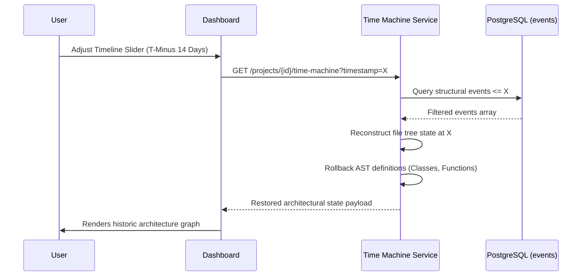

```mermaid
sequenceDiagram
    participant User
    participant Dashboard
    participant API as Time Machine Service
    participant DB as PostgreSQL (events)

    User->>Dashboard: Adjust Timeline Slider (T-Minus 14 Days)
    Dashboard->>API: GET /projects/{id}/time-machine?timestamp=X
    API->>DB: Query structural events <= X
    DB-->>API: Filtered events array
    API->>API: Reconstruct file tree state at X
    API->>API: Rollback AST definitions (Classes, Functions)
    API-->>Dashboard: Restored architectural state payload
    Dashboard->>User: Renders historic architecture graph
```
