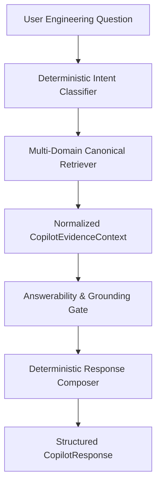

# Sprint 11 Architecture Plan: AI Engineering Copilot Foundation

> **Sprint 11 Objective**: Build an evidence-backed, provider-neutral AI Engineering Copilot Foundation on top of DepRadar's canonical intelligence layers.

---

## 1. Architectural Role & Principles

The Copilot is an **orchestration, retrieval, and synthesis layer** over all 10 existing intelligence subsystems:

### Core Invariants:

1. **Zero Hallucination / Grounded Truth**: PostgreSQL historical telemetry remains the ONLY canonical authority. Copilot never fabricates facts.
2. **Provider-Neutral & No LLM Dependency (Sprint 11)**: Operates 100% deterministically without external LLM API keys, local models, or vector databases.
3. **Tri-State Provenance Badging**: Every statement is classified as `[OBSERVED]` (direct telemetry), `[INFERRED]` (canonical model derivation), or `[UNKNOWN]` (explicitly unestablished).
4. **Answerability Gate**: If evidence is insufficient, explicitly returns `answerable = false` and explains what is known vs unknown.
5. **No Subsystem Duplication**: Composes existing services (`project_health`, `security_intelligence`, `investigation`, `predictive_intelligence`, `knowledge_graph`, `evidence`, `project_context`).
6. **Secret Safety**: `VIBEPULSE_SPRINT11_SECRET_2026` masked to `[REDACTED]`.
7. **Isolation & Reconstructibility**: Project A never leaks to Project B; $A \equiv B$.

---

## 2. Intent Classification Taxonomy

The Query Classifier deterministically maps queries to 12 intents:

| Intent                 | Sample Questions                                                   | Retrieved Subsystems                          |
| :--------------------- | :----------------------------------------------------------------- | :-------------------------------------------- |
| `PROJECT_OVERVIEW`     | "What does DepRadar know about this project?"                      | Project Context Memory, Knowledge Graph       |
| `PROJECT_HEALTH`       | "Why is this project unhealthy?", "What should I fix first?"       | Unified Health, Priorities, 5 Dimensions      |
| `SECURITY`             | "What security issues keep recurring?", "Why is auth risky?"       | Security Intelligence 2.0, AST Findings       |
| `INCIDENT`             | "Why was this incident created?", "Tell me about incident INC-123" | Investigation Engine 3.0, Evidence Graph      |
| `FILE`                 | "What happened to auth.py?", "Tell me about settings.py"           | File Intelligence, Events, Findings, Sessions |
| `SUBSYSTEM`            | "Which subsystem is under the most pressure?"                      | Subsystem Intelligence, Hotspots              |
| `PREDICTION`           | "What is likely to become a problem next?"                         | Predictive Intelligence, Forecast Signals     |
| `RESOLUTION`           | "What was resolved recently?", "Show audit history"                | Incident Review History, Resolutions          |
| `KNOWLEDGE_GRAPH`      | "What is connected to auth.py?", "Show relationships"              | Knowledge Graph Nodes & Edges                 |
| `ENGINEERING_ACTIVITY` | "What changed recently?", "Show recent sessions"                   | Sessions, Development Events, Engineering DNA |
| `EVIDENCE`             | "Why does DepRadar believe this?", "Show evidence"                 | Universal Evidence Inspector, Causal Chains   |
| `UNKNOWN`              | "Who wrote this code?", "Deploy to AWS"                            | Out of scope / unanswerable gate              |

---

## 3. Endpoints & REST Architecture

- `POST /api/projects/{project_id}/copilot/query` -> Execute question against canonical intelligence.
- `GET /api/projects/{project_id}/copilot/context` -> Export complete AI-ready Copilot evidence package.
- `GET /api/projects/{project_id}/copilot/suggestions` -> Dynamic, state-driven suggestions based on active findings and incidents.
