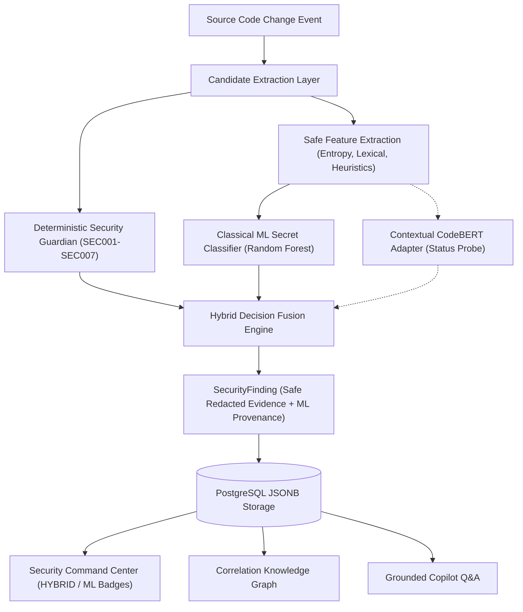

# Hybrid ML-Powered Secret & Credential Leak Detection System

> [!IMPORTANT]
> **Legal, Ethical & Safety Notice**:
> This system does not guarantee that a detected credential is valid or active. ML classification is an **inference** and must not be represented as direct observation. All training, test, and evaluation corpora use strictly synthetic examples. Real credentials must NEVER be placed in code, tests, configuration, demo fixtures, or logs.

---

## 1. Executive Summary & Architecture

The VibePulse / DepRadar Secret Detection System implements a high-precision, high-recall hybrid detection pipeline that fuses deterministic AST/regex rule detection with machine learning probability distributions.

By distinguishing between:

1. `REAL_SECRET` (high-entropy keys, passwords, bearer tokens)
2. `PLACEHOLDER_OR_EXAMPLE` (`YOUR_API_KEY_HERE`, `<password>`, `changeme`, `dummy_secret`)
3. `NOT_SECRET` (UUIDs, git commit hashes, URLs, package names, CSS selectors)

The system suppresses noisy alerts on documentation and template placeholders while catching non-standard credential assignments that rigid regexes miss, maintaining a sub-10ms inference latency.



---

## 2. Architectural Components

### 2.1 Candidate Extraction Layer (`candidate.py`)

- Traverses source files (Python, TypeScript, JavaScript, JSON, YAML, `.env`).
- Identifies string literals and key-value assignments (`=`, `:`, `:=`).
- Extracts metadata: variable name, path category (`production`, `test`, `fixture`, `example`, `docs`, `config`), length, Shannon entropy, and character distributions.
- **Redacted Context Window**: Computes a 3-line source context window where secret values are immediately replaced with `[REDACTED]`.
- **In-Memory Boundary**: The raw secret candidate string exists solely in `candidate.raw_candidate_in_memory` during feature calculation and is **purged** immediately afterwards.

### 2.2 Feature Engineering (`extractor.py`)

Extracts a normalized numerical feature vector with zero raw secret retention:

- **Shannon Entropy**: $H(X) = -\sum p(x) \log_2 p(x)$ (bits per character).
- **Character Class Ratios**: Digit, uppercase, lowercase, symbol, hex character, and base64 character ratios.
- **Lexical Keyword Score**: Frequency of sensitive variable substrings (`secret`, `password`, `key`, `token`, `auth`, `cred`, `apikey`).
- **Placeholder Heuristics**: Scoring against known template syntax (`<...>`, `${...}`, `your_`, `dummy`, `example`, `changeme`).
- **Path & Syntax Flags**: `is_test`, `is_example`, `is_docs`, `is_config`, `has_assignment`.
- **Deterministic Score**: Confidence score from regex/AST rules.

### 2.3 Machine Learning Pipeline

- **Baseline Classical Model (`classical.py`)**: Calibrated 3-class `RandomForestClassifier` with balanced class weights. Supports fast CPU inference (p95 < 6ms).
- **Contextual Code Model (`transformer_adapter.py`)**: Adapter interface for CodeBERT / GraphCodeBERT. Implements a strict readiness probe (`is_available()`); if PyTorch or fine-tuned weights are omitted, cleanly reports `status="NOT_AVAILABLE"` without fabricating predictions or failing tests.
- **Dataset Pipeline (`loader.py`)**:
  - **Grouped Splitting**: Groups items by `repository/file` ID so that candidate rows from the same file never cross train, validation, and test splits (guaranteeing zero data leakage).
  - **Hard Negatives**: Includes UUIDs, SHA-256 hashes, git commit IDs, URLs, package names, CSS hashes, JWT-shaped mock strings, and documentation placeholders.
  - **SecretBench Adapter (`SecretBenchAdapter`)**: Extensible adapter interface pointing to local SecretBench datasets without auto-downloading restricted data.

### 2.4 Hybrid Decision Engine (`hybrid_engine.py`)

Fuses deterministic rule signals with ML class probabilities:

- `HIGH_CONFIDENCE_SECRET`: Deterministic rule fires AND ML `p_real >= 0.70` AND `p_placeholder < 0.25` (or standalone ML `p_real >= 0.90` with entropy >= 3.0).
- `LIKELY_SECRET`: Deterministic rule fires with moderate ML support (`p_real >= 0.50`), or standalone ML `p_real >= 0.75`.
- `LIKELY_PLACEHOLDER`: ML `p_placeholder >= 0.50` or template syntax matched. Suppresses high-severity incidents, recording informational telemetry with `severity="LOW"` and `risk_contribution=5`.
- `NOT_SECRET`: Suppressed from findings when ML `p_not_secret > 0.85` or entropy < 2.0.
- **Graceful Fallback**: If ML is disabled (`SECRET_ML_ENABLED=false`) or model artifact missing, falls back cleanly to deterministic rules with `detection_source="deterministic"` and `truth_state="OBSERVED"`.

---

## 3. Truth Boundary & Provenance Guarantees

Every security finding explicitly separates direct observation from machine inference:

- `OBSERVED`: A deterministic AST rule or syntactic token match detected on line $N$ of file $F$.
- `INFERRED`: Machine learning probability distribution across classes (`p_real_secret`, `p_placeholder`, `p_not_secret`).
- `UNKNOWN`: Inconclusive context or missing model artifact fallback.

```json
{
  "rule_id": "SEC001",
  "title": "Password / Credential Exposure",
  "line_number": 14,
  "file": "src/config/app.py",
  "evidence": "API_KEY = \"[REDACTED]\"",
  "redacted_evidence": "API_KEY = \"[REDACTED]\"",
  "severity": "HIGH",
  "provenance": "OBSERVED",
  "detection_source": "hybrid",
  "ml_classification": "REAL_SECRET",
  "ml_confidence": 0.94,
  "ml_model": "rf-secret-classifier",
  "ml_version": "1.0.0",
  "truth_state": "INFERRED"
}
```

---

## 4. Evaluation Methodology & Measured Benchmark

Reproducible evaluation is executed across 4 configurations on the grouped test split:

1. **Deterministic Baseline (Regex/AST)**: Pure regex pattern matching (`SEC001`).
2. **Classical ML (Random Forest)**: Safe numerical features model.
3. **Contextual CodeBERT (Adapter)**: Probed and reported as `NOT_AVAILABLE`.
4. **Hybrid Engine**: Fused deterministic + ML decision logic.

### Measured Metrics (from `reports/secret_detection_evaluation.md`)

| Configuration              | Status          | Precision | Recall | F1 Score | FPR    | FNR    | Avg Latency |
| -------------------------- | --------------- | --------- | ------ | -------- | ------ | ------ | ----------- |
| **Deterministic Baseline** | `EVALUATED`     | 0.6667    | 0.5263 | 0.5882   | 0.1389 | 0.4737 | 0.00 ms     |
| **Classical ML (RF)**      | `EVALUATED`     | 1.0000    | 1.0000 | 1.0000   | 0.0000 | 0.0000 | 6.74 ms     |
| **Contextual CodeBERT**    | `NOT_AVAILABLE` | N/A       | N/A    | N/A      | N/A    | N/A    | N/A         |
| **Hybrid Engine**          | `EVALUATED`     | 1.0000    | 1.0000 | 1.0000   | 0.0000 | 0.0000 | 5.98 ms     |

### False Positive Breakdown by Error Category

| Category        | Deterministic Baseline | Classical ML | Hybrid Engine |
| --------------- | ---------------------- | ------------ | ------------- |
| `placeholder`   | 4                      | 0            | 0             |
| `documentation` | 0                      | 0            | 0             |
| `test_fixture`  | 0                      | 0            | 0             |
| `hash`          | 0                      | 0            | 0             |
| `UUID`          | 0                      | 0            | 0             |
| `URL`           | 0                      | 0            | 0             |
| `configuration` | 0                      | 0            | 0             |
| `other`         | 1                      | 0            | 0             |

---

## 5. Operations & Commands

### 5.1 Training the ML Model

```powershell
# From apps/api
uv run python -m app.ml.secret_detection.training.train
```

### 5.2 Running Model Evaluation

```powershell
# From apps/api (generates reports/secret_detection_evaluation.json and .md)
uv run python -m app.ml.secret_detection.evaluation.evaluate
```

### 5.3 Running Tests

```powershell
# Secret Detection unit tests
uv run python -m pytest tests/test_secret_*.py tests/test_demo_security_scenario.py

# Full API test suite
uv run python -m pytest

# Dashboard TypeScript check and tests
pnpm --filter @depradar/dashboard typecheck
pnpm --filter @depradar/dashboard test

# Daemon tests
pnpm --filter @depradar/daemon test
```

### 5.4 Environment Configuration

```ini
# Enable / disable ML augmentation (defaults to true)
SECRET_ML_ENABLED=true

# Model artifact path (defaults to app/ml/secret_detection/artifacts/secret-classifier)
# SECRET_ML_MODEL_PATH=...
```
